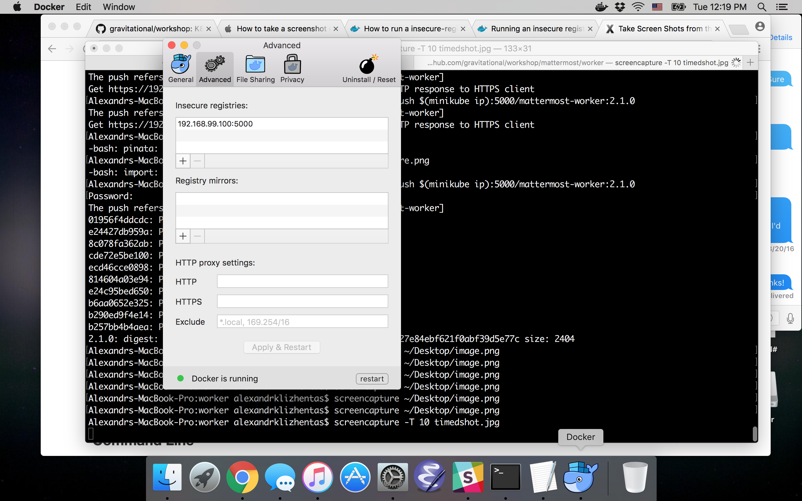

# Gravitational Workshops

Open source series of workshops delivered by Gravitational services team.

* [Docker 101 workshop](docker.md)
* [Kubernetes 101 workshop using Minikube and Mattermost](k8s101.md)
* [Kubernetes production patterns](k8sprod.md)

## Installation

### Requirements

You will need Mac OSX with at least `7GB RAM` and `8GB free disk space` available.

* docker
* VirtualBox
* kubectl
* minikube

### Docker

For Linux: follow instructions provided [here](https://docs.docker.com/engine/installation/linux/).

If you have Mac OS X (Yosemite or newer), please download Docker for Mac [here](https://download.docker.com/mac/stable/Docker.dmg).

*Older docker package for OSes older than Yosemite -- Docker Toolbox located [here](https://www.docker.com/products/docker-toolbox).*

### VirtualBox

Let’s install VirtualBox first.

Get latest stable version from https://www.virtualbox.org/wiki/Downloads

### Kubectl

For Mac OS X:

    curl -O https://storage.googleapis.com/kubernetes-release/release/v1.6.4/bin/darwin/amd64/kubectl \
        && chmod +x kubectl && sudo mv kubectl /usr/local/bin/

For Linux:

    curl -O https://storage.googleapis.com/kubernetes-release/release/v1.6.4/bin/linux/amd64/kubectl \
        && chmod +x kubectl && sudo mv kubectl /usr/local/bin/

### Minikube

For Mac OS X:

    curl -Lo minikube https://storage.googleapis.com/minikube/releases/v0.20.0/minikube-darwin-amd64 \
        && chmod +x minikube && sudo mv minikube /usr/local/bin/

For Linux:

    curl -Lo minikube https://storage.googleapis.com/minikube/releases/v0.20.0/minikube-linux-amd64 \
        && chmod +x minikube && sudo mv minikube /usr/local/bin/

Also, you can install drivers for various VM providers to optimize your minikube VM performance.
Instructions can be found here: https://github.com/kubernetes/minikube/blob/master/DRIVERS.md.

### Xcode and local tools

Xcode will install essential console utilities for us. You can install it from AppStore.

## Set up cluster using minikube

To run cluster:

```
minikube start
kubectl get nodes
# from the workshop directory
kubectl apply -f registry.yaml
```

**Notice for Mac OS X users:** you need to allow your docker daemon to work with your local insecure registry. It could be achieved via adding VM address to Docker for Mac.

1. Get minikube VM IP via calling `minikube ip`
2. Add obtained IP with port 5000 (specified above in `docker run` command) to Docker insecure registries:




