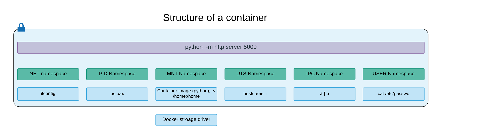

# Docker 101

Docker 101 workshop - introduction to Docker and basic concepts

## Installation

### Hardware Requirements

You will need an MacOS or Linux based system with at least `8GB RAM` and `10GB of free disk space` available.

While it is possible to use Docker on Windows 10 systems, for the sake of simplicity, in this workshop will focus on POSIX compatible systems that are officially supported by Docker, like MacOS and Linux.

### Software Requirements

The main software required to follow this workshop is *Docker* itself.

In order to install it on *Linux*: follow instructions provided [here](https://docs.docker.com/engine/installation/linux/).

If you have Mac OS X (Yosemite or newer), please download Docker for Mac [here](https://download.docker.com/mac/stable/Docker.dmg).

*Older docker package for OSes older than Yosemite -- Docker Toolbox located [here](https://www.docker.com/products/docker-toolbox).*

### Video version

This workshop is also available as a video on YouTube at the following link:

[Workshop video](https://youtu.be/h7T8Sh1QrJU)

## Introduction

### Hello, world

Docker is as easy as Linux! To prove that let us write classic "Hello, World" in Docker:

```bash
$ docker run busybox echo "hello world"
```

Docker containers are just as simple as Linux processes, but they also provide many more features that we are going to explore.

Let's review the structure of the command we just used:

```bash
docker             # Docker client binary used to interact with Docker
run                # Docker subcommand - runs a command in a container
busybox            # container image used by the run command
echo "hello world" # actual command to run (and arguments)
```

*Container images* carry within themselves all the needed libraries, binaries and directories in order to be able to run.

*TIP:* Container images could be abstracted as "the blueprint for an object", while containers themselves are the actualization of the object into a real instance/entity.

Commands running in containers normally use anything but the kernel from the host operating system. They will execute instead binaries provided within the chosen container image (`busybox` in the example above).

### Where is my container?

Running containers can be listed using the command:
```bash
$ docker ps
```

Here's an example showing a possible output from the `ps` command:

```
$ docker ps
CONTAINER ID        IMAGE                COMMAND                  CREATED             STATUS              PORTS                    NAMES
eea49c9314db        library/python:3.3   "python -m http.serve"   3 seconds ago       Up 2 seconds        0.0.0.0:5000->5000/tcp   simple1
```

The fields shown in the output can be summarized as:

* Container ID - auto generated unique running id
* Container image - image name
* Command - Linux process running as the PID 1 in the container
* Names - user friendly name of the container

After running the "hello world" example above though there will be no running container since the entire life cycle of the command (`echo "hello world"`) has already finished and thus the container stopped.

Once the command running inside the container finishes its execution, the container will stop running but will still be available, even if it's not listed in `ps` output by default.

To list all containers, including stopped ones, use:
```bash
docker ps -a
```

Stopped containers will remain available until cleaned. You can then removed stopped containers by using:
```bash
docker rm my_container_name_or_id
```
The argument used for the `rm` command can be the container ID or the container name.

If you prefer, it's possible to add the option `--rm` to the `run` subcommand so that the container will be cleaned automatically as soon as it stops its execution.

### Adding environment variables

Let's see what environment variables are used by default:

```
$ docker run --rm busybox env
PATH=/usr/local/sbin:/usr/local/bin:/usr/sbin:/usr/bin:/sbin:/bin
HOSTNAME=0a0169cdec9a
HOME=/root
```

The environment variables passed to the container may be different on other systems and the hostname is randomized per container, unless specified differently.

When needed we can extend the environment by passing variable flags as `docker run` arguments:

```bash
$ docker run --rm -e HELLO=world busybox env
PATH=/usr/local/sbin:/usr/local/bin:/usr/sbin:/usr/bin:/sbin:/bin
HOSTNAME=8ee8ba3443b6
HELLO=world
HOME=/root
```

### Sneak peek into the container environment

Let's now take a look at process tree running in the container:

```bash
$ docker run --rm busybox ps uax
```

My terminal prints out something similar to:

```bash
PID   USER     TIME  COMMAND
    1 root       0:00 ps uax
```

*Oh my!* Am I running this command as root? Technically yes, although remember as we anticipated this is not the actual root of your host system but a very limited one running inside the container. We will get back to the topic of users and security a bit later.

In fact, as you can see, the process runs in a very limited and isolated environment where it cannot see or access all the other processes running on your machine.

### Adding host mounts

The filesystem used inside running containers is also isolated and separated from the one in the host:

```bash
$ docker run --rm busybox ls -l /home
total 0
```

What if we want to expose one or more directories inside a container? To do so the option `-v/--volume` must be used as shown in the following example:

```
$ docker run --rm -v $(pwd):/home busybox ls -l /home
total 72
-rw-rw-r--    1 1000     1000         11315 Nov 23 19:42 LICENSE
-rw-rw-r--    1 1000     1000         30605 Mar 22 23:19 README.md
drwxrwxr-x    2 1000     1000          4096 Nov 23 19:30 conf.d
-rw-rw-r--    1 1000     1000          2922 Mar 23 03:44 docker.md
drwxrwxr-x    2 1000     1000          4096 Nov 23 19:35 img
drwxrwxr-x    4 1000     1000          4096 Nov 23 19:30 mattermost
-rw-rw-r--    1 1000     1000           585 Nov 23 19:30 my-nginx-configmap.yaml
-rw-rw-r--    1 1000     1000           401 Nov 23 19:30 my-nginx-new.yaml
-rw-rw-r--    1 1000     1000           399 Nov 23 19:30 my-nginx-typo.yaml
```

In the example command the current directory, specified via `$(pwd)`, was "mounted" from the host system in the container so that it appeared to be "/home" inside the container!

In this configuration all changes done in the specified directory will be immediately seen in the container's `/home` directory.

### Network

Networking in Docker containers is also isolated. Let's look at the interfaces inside a running container:

```bash
$ docker run --rm busybox ifconfig
eth0      Link encap:Ethernet  HWaddr 02:42:AC:11:00:02  
          inet addr:172.17.0.2  Bcast:0.0.0.0  Mask:255.255.0.0
          inet6 addr: fe80::42:acff:fe11:2/64 Scope:Link
          UP BROADCAST RUNNING MULTICAST  MTU:1500  Metric:1
          RX packets:1 errors:0 dropped:0 overruns:0 frame:0
          TX packets:1 errors:0 dropped:0 overruns:0 carrier:0
          collisions:0 txqueuelen:0 
          RX bytes:90 (90.0 B)  TX bytes:90 (90.0 B)

lo        Link encap:Local Loopback  
          inet addr:127.0.0.1  Mask:255.0.0.0
          inet6 addr: ::1/128 Scope:Host
          UP LOOPBACK RUNNING  MTU:65536  Metric:1
          RX packets:0 errors:0 dropped:0 overruns:0 frame:0
          TX packets:0 errors:0 dropped:0 overruns:0 carrier:0
          collisions:0 txqueuelen:1 
          RX bytes:0 (0.0 B)  TX bytes:0 (0.0 B)
```

#### Networking example

In case you're not familiar with Python, one of the built-in modules offer simple HTTP server features and by default it will serve the current directory via HTTP on the port specified as the command argument (5000) in our case.

The following command should work on any Linux or MacOS system that has Python installed, and will offer your current directory content via HTTP on port 5000:
```bash
$ python -m http.server 5000
```

We'll now translate that command in a Docker container, so that you won't need Python installed on your system (cause it will be provided inside the container).
To forward port 5000 from the host system to port 5000 inside the container the `-p` flag should be added to the `run` command:

```bash
$ docker run --rm -p 5000:5000 library/python:3 python -m http.server 5000
```

This command remains alive and attached to the current session because the server will keep listening for requests.
Try reaching it from a different terminal via the following command:

```bash
$ curl http://localhost:5000
<!DOCTYPE HTML PUBLIC "-//W3C//DTD HTML 4.01//EN" "http://www.w3.org/TR/html4/strict.dtd">
<html>
<head>
....
```

Press `Ctrl-C` in the terminal running the container to stop it.

## A bit of background



The basic idea behind containers is a set of Linux resources that run isolated from the rest of the host OS.

[chart](https://www.lucidchart.com/documents/edit/d5226f07-00b1-4a7a-ba22-59e0c2ec0b77/0)

Multiple Linux subsystems help to create the container foundations:

### Namespaces

Namespaces create isolated stacks of Linux primitives for a running process.

* NET namespace creates a separate networking stack for the container, with its own routing tables and devices.
* PID namespace is used to assign isolated process IDs that are separate from host OS. This is important to avoid any information exposure from the host about processes.
* MNT namespace creates a scoped view of a filesystem using [VFS](http://www.tldp.org/LDP/khg/HyperNews/get/fs/vfstour.html). It allows a container to get its own "root" filesystem and map directories from one location on the host to the other location inside container.
* UTS namespace lets container to get to its own hostname.
* IPC namespace is used to isolate inter-process communication (e.g. IPC, pipes, message queues and so on).
* USER namespace allows container processes have different users and IDs from the host OS.

### Control groups

Control Groups (also called `cgroups`) are kernel feature that limits, accounts for, and isolates resources usage (CPU, memory, disk I/O, network, etc.)

This feature is particularly useful to predict and plan for enough resources to accommodate the desired number of containers on your systems.

### Capabilities

Capabilities provide enhanced permission checks on the running process, and can limit the interface configuration, even for a root user - for example if `CAP_NET_ADMIN` is disabled users inside a container (including root) won't be able to manage network interfaces (add, delete, change), change network routes and so on.

You can find a lot of additional low level detail [here](http://crosbymichael.com/creating-containers-part-1.html) or see `man capabilities` for more info about this topic.

## More container operations

### Daemons

Our last python server example was inconvenient as it worked in foreground so it was bound to our shell. If we closed our shell the container would also die with it. In order to fix this problem let's change our command to:

```bash
$ docker run --rm -d -p 5000:5000 --name=simple1 library/python:3 python -m http.server 5000
```

Flag `-d` instructs Docker to start the process in background. Let's see if our HTTP connection still works after we close our session:

```bash
curl http://localhost:5000
<!DOCTYPE HTML PUBLIC "-//W3C//DTD HTML 4.01//EN" "http://www.w3.org/TR/html4/strict.dtd">
<html>
<head>
...
```

It's still working and now we can see it running with the `ps` command:
```bash
docker ps
CONTAINER ID        IMAGE                COMMAND                  CREATED             STATUS              PORTS                    NAMES
eea49c9314db        library/python:3     "python -m http.serve"   3 seconds ago       Up 2 seconds        0.0.0.0:5000->5000/tcp   simple1
```

### Inspecting a running container

If we want more information about a running container we can check its logs output using the `logs` command:

```bash
$ docker logs simple1
```

Docker also offers the useful command `inspect` which retrieves all the info related to a specific object (network, container, image, ecc):

```bash
docker inspect kind_bell
[
    {
        "Id": "1da9cdd92fc3f69cf7cd03b2fa898c06fdcfb8f9913479d6fa15688a4984c877",
        "Created": "2019-06-01T19:04:49.344803709Z",
        "Path": "echo",
        "Args": [
            "hello world"
        ],
        "State": {
            "Status": "exited",
...
```

### Attaching to a running container**

While a container is still running, we can enter its namespaces using the `exec` command:

```bash
$ docker exec -ti simple1 /bin/sh
```

The command above will open an `sh` interactive shell that we can use to look around and play with, inside the container.

One little note about the additional options specified in the `exec` command.

* `-t` flag attaches terminal for interactive typing
* `-i` flag attaches input/output from the terminal to the process

Now that we have opened a new shell inside the container, let's find what process is running as PID 1:

This workflow is similar to using `SSH` to connect in the container, however there is no remote network connection involved.
The process `/bin/sh` shell session is started running in the container namespaces instead of the host OS ones.

```bash
$ ps uax
USER       PID %CPU %MEM    VSZ   RSS TTY      STAT START   TIME COMMAND
root         1  0.5  0.0  74456 17512 ?        Ss   18:07   0:00 python -m http.server 5000
root         7  0.0  0.0   4336   748 ?        Ss   18:08   0:00 /bin/sh
root        13  0.0  0.0  19188  2284 ?        R+   18:08   0:00 ps uax
```

### Attaching to containers input

To best illustrate the impact of `-i` or `--interactive` in the expanded version, consider this example:

```bash
$ echo "hello there" | docker run --rm busybox grep hello
```

The example above won't work as the container's input is not attached to the host stdout. The `-i` flag fixes just that:

```bash
$ echo "hello there" | docker run --rm -i busybox grep hello
hello there
```

### Starting and stopping containers

It is possible to stop and start long-living containers using `stop` and `start` commands:

```bash
$ docker stop simple1
$ docker start simple1
```

**NOTE:** container names should be unique. Otherwise, you will get an error when you try to create a new container with a conflicting name!

## Building Container images

So far we have been using container images downloaded from Docker's public registry.

One of the key success factors for Docker among competitors was the possibility to easily create, customize, share and improve container images cooperatively.

Let's see how it works.

### Starting from scratch

`Dockerfile` is a special file that instructs `docker build` command how to build an image:

```bash
$ cd docker/scratch
$ cat hello.sh
$ docker build -t hello .
Sending build context to Docker daemon 3.072 kB
Step 1 : FROM scratch
 ---> 
Step 2 : ADD hello.sh /hello.sh
 ---> 4dce466cf3de
Removing intermediate container dc8a5b93d5a8
Successfully built 4dce466cf3de
```

The Dockerfile used is very simple:

```dockerfile
FROM scratch
ADD hello.sh /hello.sh
```

* `FROM scratch` instructs the Docker build process to use an empty image as the basis to build our custom container image
* `ADD hello.sh /hello.sh` adds the file `hello.sh` to the container's root path `/hello.sh`.

### Viewing images

`docker images` command is used to display images that we have built:

```bash
docker images
REPOSITORY                                    TAG                 IMAGE ID            CREATED             SIZE
hello                                         latest              4dce466cf3de        10 minutes ago      34 B
```

Here's a quick explanation of the columns shown in that output:

* Repository - a name associated to this image locally (on your computer) or on a remote repository. Our current repository is local and the image is called `hello`
* Tag - indicates the version of our image, Docker sets `latest` tag automatically if none is specified
* Image ID - unique image ID
* Size - the size of our image is just 34 bytes

**NOTE:** Docker images are quite different from virtual machine image formats. Since Docker does not boot any operating system, but simply runs Linux processes in isolation, we don't need any kernel or drivers to ship with the image, so it could be as tiny as just a few bytes!

### Running the image

Trying to run our newly built image will result in an error similar to one of the following, depending on the Docker version:

```bash
$ docker run --rm hello /hello.sh
write pipe: bad file descriptor
```

or

```bash
standard_init_linux.go:211: exec user process caused "no such file or directory"
```

This is because our container is empty. There is no shell and the script won't be able to start!
Let's fix that by changing our base image to `busybox` that contains a proper shell environment:

```bash
$ cd docker/busybox
$ docker build -t hello .
Sending build context to Docker daemon 3.072 kB
Step 1 : FROM busybox
 ---> 00f017a8c2a6
Step 2 : ADD hello.sh /hello.sh
 ---> c8c3f1ea6ede
Removing intermediate container fa59f3921ff8
Successfully built c8c3f1ea6ede
```

Listing the image shows that image ID and size have changed:

```bash
$ docker images
REPOSITORY                                    TAG                 IMAGE ID            CREATED             SIZE
hello                                         latest              c8c3f1ea6ede        10 minutes ago      1.11 MB
```

We can run our script now:

```bash
$ docker run --rm hello /hello.sh
hello, world!
```

### Versioning

Let us roll a new version of our script `v2`

```bash
$ cd docker/busybox-v2
$ cat Dockerfile
FROM busybox
ADD hello.sh /hello.sh
$ docker build -t hello:v2 .
```

We will now see 2 images `hello:v2` and `hello:latest`:

```bash
$ docker images
hello                                         v2                  195aa31a5e4d        2 seconds ago       1.11 MB
hello                                         latest              47060b048841        20 minutes ago      1.11 MB
```

**NOTE:** Tag `latest` will not automatically point to the latest version, so you have to manually update it

Execute the script using `image:tag` notation:

```bash
$ docker run --rm hello:v2 /hello.sh
hello, world v2!
```

### Entry point

We can improve our image by supplying `entrypoint`, which sets the default command executed if none is specified when starting the container:

```bash
$ cd docker/busybox-entrypoint
$ cat Dockerfile
FROM busybox
ADD hello.sh /hello.sh
ENTRYPOINT ["/hello.sh"]
$ docker build -t hello:v3 .
```

We should now be able to run the new image version without supplying additional arguments:

```bash
$ docker run --rm hello:v3
hello, world !
```

What happens if you pass an additional argument as in previous examples? They will be passed to the `ENTRYPOINT` command as arguments:

```bash
$ docker run --rm hello:v3 woo
hello, world woo!
```

Arguments are then appended to the output because our v3 `hello.sh` is set to do so via the use of the `$@` magic variable:

```bash
#!/bin/sh

echo "hello, world $@!"
```

### Environment variables

We can pass environment variables during build and during runtime as well.

Here's our modified `hello.sh` shellscript:

```bash
$ cd docker/busybox-env
$ cat hello.sh
#!/bin/sh

echo "hello, $BUILD1 and $RUN1!"
```

Dockerfile now uses `ENV` directive to provide environment variable:

```Dockerfile
FROM busybox
ADD hello.sh /hello.sh
ENV BUILD1 Bob
ENTRYPOINT ["/hello.sh"]
```

Let's build and run:

```bash
cd docker/busybox-env
$ docker build -t hello:v4 .
$ docker run --rm -e RUN1=Alice hello:v4
hello, Bob and Alice!
```

Though it's important to know that **variables specified at runtime takes precedence over those specified at build time**:
```bash
$ docker run --rm -e BUILD1=Jon -e RUN1=Alice hello:v4
hello, Jon and Alice!
```

### Build arguments

Sometimes it is helpful to supply arguments during build process
(for example, user ID to be created inside the container). 
We can supply build arguments as flags to `docker build` as we already did to the `run` command:

```bash
$ cd docker/busybox-arg
$ docker build --build-arg=ARG1="Alice and Bob" -t hello:v5 .
$ docker run hello:v5
hello, Alice and Bob!
```

Here is our updated Dockerfile:

```Dockerfile
FROM busybox
ADD hello.sh /hello.sh
ARG BUILD1
ENV BUILD1 $BUILD1
ENTRYPOINT ["/hello.sh"]
```

Notice how `ARG` have supplied the build argument and we have referred to it right away in the Dockerfile itself, and also exposing it as environment variable afterward.

### Build layers and caching

Let's take a look at the new build image in the `docker/cache` directory:

```bash
$ ls -l docker/cache/
total 12
-rw-rw-r-- 1 sasha sasha 76 Mar 24 16:23 Dockerfile
-rw-rw-r-- 1 sasha sasha  6 Mar 24 16:23 file
-rwxrwxr-x 1 sasha sasha 40 Mar 24 16:23 script.sh
```

We have a file and a script that uses the file:

```bash
$ cd docker/cache
$ docker build -t hello:v6 .

Sending build context to Docker daemon 4.096 kB
Step 1 : FROM busybox
 ---> 00f017a8c2a6
Step 2 : ADD file /file
 ---> Using cache
 ---> 6f48df47cb1d
Step 3 : ADD script.sh /script.sh
 ---> b052fd11bcc6
Removing intermediate container c555e8ab29dc
Step 4 : ENTRYPOINT /script.sh
 ---> Running in 50f057fd89cb
 ---> db7c6f36cba1
Removing intermediate container 50f057fd89cb
Successfully built db7c6f36cba1

$ docker run --rm hello:v6
hello, hello!
```

Let's update the script.sh

```bash
cp script2.sh script.sh
```

They are only different by one letter, but this makes a difference:


```bash
$ docker build -t hello:v7 .
$ docker run --rm hello:v7
Hello, hello!
```

Notice `Using cache` diagnostic output from the container:

```
$ docker build -t hello:v7 .
Sending build context to Docker daemon  5.12 kB
Step 1 : FROM busybox
 ---> 00f017a8c2a6
Step 2 : ADD file /file
 ---> Using cache
 ---> 6f48df47cb1d
Step 3 : ADD script.sh /script.sh
 ---> b187172076e2
Removing intermediate container 7afa2631d677
Step 4 : ENTRYPOINT /script.sh
 ---> Running in 51217447e66c
 ---> d0ec3cfed6f7
Removing intermediate container 51217447e66c
Successfully built d0ec3cfed6f7
```

Docker executes every command in a special container. It detects the fact that the content has (or has not) changed, and instead of re-executing the command, uses cached value instead. This helps to speed up builds, but sometimes introduces problems.

**NOTE:** You can always turn caching off by using the `--no-cache=true` option for the `docker build` command.

Docker images are composed of layers:


Every layer is a the result of the execution of a command in the Dockerfile.

### RUN command

The most frequently used command is `RUN` as it executes the command in a container, captures the output and records it as an image layer.

Let's us use existing package managers to compose our images:

```Dockerfile
FROM ubuntu:18.04
RUN apt-get update
RUN apt-get install -y curl
ENTRYPOINT curl
```

Since this example is based on the `ubuntu` Docker image, the output of this build will look more like a standard Linux install:

```bash
$ cd docker/ubuntu
$ docker build -t myubuntu .
```

We can use our newly created ubuntu to curl pages:

```bash
$ # don't use `--rm` this time
$ docker run myubuntu https://google.com
  % Total    % Received % Xferd  Average Speed   Time    Time     Time  Current
                                 Dload  Upload   Total   Spent    Left  Speed
100   220  100   220    0     0   1377      0 --:--:-- --:--:-- --:--:--  1383
<HTML><HEAD><meta http-equiv="content-type" content="text/html;charset=utf-8">
<TITLE>301 Moved</TITLE></HEAD><BODY>
<H1>301 Moved</H1>
The document has moved
<A HREF="https://www.google.com/">here</A>.
</BODY></HTML>
```

However, it all comes at a price:

```bash
$ docker images
REPOSITORY                                    TAG                 IMAGE ID            CREATED             SIZE
myubuntu                                      latest              50928f386c70        53 seconds ago      106 MB
```

That is 106MB for curl! As we know, there is no mandatory requirement to have images with all the OS inside.
If base on your use-case you still need it though, Docker will save you some space by re-using the base layer, so images with slightly different bases would not repeat each other.

### Operations with images

You are already familiar with one command, `docker images`. You can also remove images, tag and untag them.

#### Removing images and containers

Let's start with removing the image that takes too much disk space:

```bash
$ docker rmi myubuntu
Error response from daemon: conflict: unable to remove repository reference "myubuntu" (must force) - container 292d1e8d5103 is using its referenced image 50928f386c70
```

Docker complains that there are containers using this image. How is this possible? As mentioned previously docker keeps track of all containers, even those that have stopped and won't allow deleting images used by existing containers, running or not:

```bash
$ docker ps -a
CONTAINER ID        IMAGE                        COMMAND                   CREATED             STATUS                           PORTS                    NAMES
292d1e8d5103        myubuntu                     "curl https://google."    5 minutes ago       Exited (0) 5 minutes ago                                  cranky_lalande
f79c361a24f9        440a0da6d69e                 "/bin/sh -c curl"         5 minutes ago       Exited (2) 5 minutes ago                                  nauseous_sinoussi
01825fd28a50        440a0da6d69e                 "/bin/sh -c curl --he"    6 minutes ago       Exited (2) 5 minutes ago                                  high_davinci
95ffb2131c89        440a0da6d69e                 "/bin/sh -c curl http"    6 minutes ago       Exited (2) 6 minutes ago                                  lonely_sinoussi
```

We can now delete the container:

```bash
$ docker rm 292d1e8d5103
292d1e8d5103
```

and the image:

```bash
$ docker rmi myubuntu
Untagged: myubuntu:latest
Deleted: sha256:50928f386c704610fb16d3ca971904f3150f3702db962a4770958b8bedd9759b
```

### Tagging images

`docker tag` helps us to tag images.

We have quite a lot of versions of `hello` built, but latest still points to the old `v1`.

```bash
$ docker images | grep hello
hello                                         v7                  d0ec3cfed6f7        33 minutes ago      1.11 MB
hello                                         v6                  db7c6f36cba1        42 minutes ago      1.11 MB
hello                                         v5                  1fbecb029c8e        About an hour ago   1.11 MB
hello                                         v4                  ddb5bc88ebf9        About an hour ago   1.11 MB
hello                                         v3                  eb07be15b16a        About an hour ago   1.11 MB
hello                                         v2                  195aa31a5e4d        3 hours ago         1.11 MB
hello                                         latest              47060b048841        3 hours ago         1.11 MB
```

Let's change that by re-tagging `latest` to `v7`:

```bash
$ docker tag hello:v7 hello:latest
$ docker images | grep hello
hello                                         latest              d0ec3cfed6f7        38 minutes ago      1.11 MB
hello                                         v7                  d0ec3cfed6f7        38 minutes ago      1.11 MB
hello                                         v6                  db7c6f36cba1        47 minutes ago      1.11 MB
hello                                         v5                  1fbecb029c8e        About an hour ago   1.11 MB
hello                                         v4                  ddb5bc88ebf9        About an hour ago   1.11 MB
hello                                         v3                  eb07be15b16a        About an hour ago   1.11 MB
hello                                         v2                  195aa31a5e4d        3 hours ago         1.11 MB
```

Both `v7` and `latest` point to the same image ID `d0ec3cfed6f7`.

### Publishing images

Images are distributed with a special service - `docker registry`.
Let us spin up a local registry:

```bash
$ docker run --rm -p 5000:5000 --name registry -d registry:2
```

`docker push` is used to publish images to registries.

To instruct where we want to publish, we need to prepend registry address to image name:

```bash
$ docker tag hello:v7 127.0.0.1:5000/hello:v7
$ docker push 127.0.0.1:5000/hello:v7
```

`docker push` pushed the image to our "remote" registry.

We can now download the image using the `docker pull` command:

```bash
$ docker pull 127.0.0.1:5000/hello:v7
v7: Pulling from hello
Digest: sha256:c472a7ec8ab2b0db8d0839043b24dbda75ca6fa8816cfb6a58e7aaf3714a1423
Status: Image is up to date for 127.0.0.1:5000/hello:v7
```

### Wrapping up

We have learned how to start, build and publish containers and learned the containers building blocks.
However, there is much more to learn. Just check out the [official docker documentation!](https://docs.docker.com/engine/userguide/).

Thanks to the Docker team for such an amazing product!
