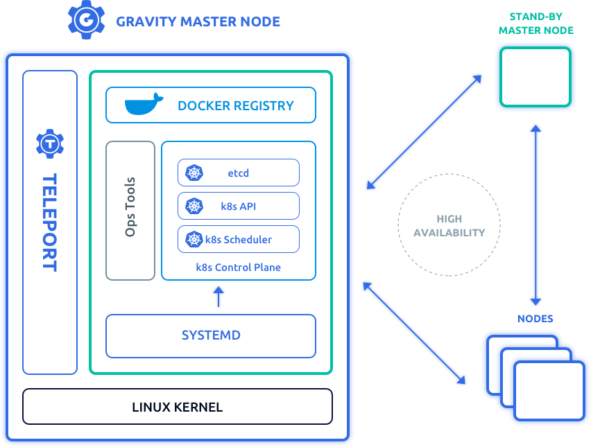

# Gravity 101

## Prerequisites

Docker 101 and Kubernetes 101.

## Setup

For this training we’ll need:

* 1 machine for building installers. Can be any Linux (preferably Ubuntu 18.04 or recent CentOS) with installed Docker 18.06 or newer.

* 3 machines for deploying a cluster. Clean nodes, preferably Ubuntu 18.04 or recent CentOS.

## What is Gravity?

Gravity is a set of tools that let you achieve the following results:

* Package complex Kubernetes application(-s) as self-contained, deployable “images”.

* Use those images to provision multi-node hardened HA Kubernetes clusters from scratch on any fleet of servers in the cloud or on-prem, including fully air-gapped environments, with a single command (or a click).

* Perform cluster health monitoring and lifecycle management (such as scaling up/down), provide controlled, secure and audited access to the cluster nodes, automatically push application updates to many clusters and much more.

You can think of Gravity as an “image” management toolkit and draw an analogy with Docker: with Docker you build a “filesystem image” and use that image to spin up many containers, whereas Gravity allows you to build a “cluster image” and spin up many Kubernetes cluster with it.

Let’s take a look at how we build a cluster image.

## Building Cluster Image

### Tele

To be able to build images, we need a tool called `tele`.

`tele` is a single binary - again, drawing an analogy with Docker (there will be a few more of those in this chapter), it can be thought of as an equivalent of the `docker` binary: to build a Docker image you would run `docker build` command, and to build a cluster image there is a `tele build` command which we’ll explore below.

`tele` can be downloaded by running the following command:

```
curl https://get.gravitational.io/telekube/install/7.0.30 | bash
```

`7.0.30` may be substituted for a preferred release.  For all releases, see the [Releases](https://gravitational.com/gravity/docs/changelog/) page.

### Cluster Manifest

As a next step, we need to create a cluster manifest. Cluster manifest is the equivalent of a “Dockerfile” for your cluster image - it is used to describe basic cluster metadata, provide requirements for the cluster nodes, define various cluster lifecycle hooks and so on.

Our [documentation](https://gravitational.com/gravity/docs/pack/#application-manifest) provides a full list of parameters that the manifest lets you tweak, but for now let’s create the simplest possible manifest file. The manifest file is usually named `app.yaml`.

The simplest possible manifest file looks like this:

```bash
build$ cat ~/workshop/gravity101/v1-simplest/app.yaml
```

```yaml
apiVersion: cluster.gravitational.io/v2
kind: Cluster
metadata:
 name: cluster-image
 resourceVersion: 0.0.1
```

Let’s inspect it a bit closer.

As you can see, it has YAML format and resembles the structure of Kubernetes resource specs. So far all the fields in the manifest should be self-explanatory. One thing worth mentioning is that the image version must be a valid semver - it is used to ensure stable comparisons of two versions, for example during upgrades.

Now let’s build the cluster image:

```bash
build$ tele build ~/workshop/gravity101/v1-simplest/app.yaml
* [1/6] Selecting base image version
       Will use base image version 6.1.11
* [2/6] Downloading dependencies from https://get.gravitational.io
* [3/6] Embedding application container images
       Detected application manifest app.yaml
       Found no images to vendor in application manifest app.yaml
       Pulling remote image quay.io/gravitational/debian-tall:buster
       Vendored image gravitational/debian-tall:buster
* [4/6] Creating application
* [5/6] Generating the cluster snapshot
* [6/6] Saving the snapshot as cluster-image-0.0.1.tar
* [6/6] Build completed in 8 seconds
```

Let’s explore what has happened, step-by-step.

Step 1. First, `tele` makes a decision of what “base” image to use for our cluster image. We’ll explore what a base image is and how it is picked in more detail in a minute.

Step 2. Next, `tele` downloads all required dependencies based on the selected base image. The downloaded dependencies are cached locally and will be reused for all subsequent builds.

Step 3. Next, `tele` parses the application resources and discovers all Docker images that the application requires - all Docker image are embedded into the resulting cluster image. This process is called vendoring. All vendored images will be made available in the cluster-local Docker registry when the cluster is installed. We have not provided any application resources at the moment - only the application manifest - so tele only vendored a single image that is used for some internal operations.

Steps 4-6. Finally, `tele` builds the cluster image by packaging all application resources and vendored Docker images together in a single tarball.

The resulting file, `cluster-image-0.0.1.tar`, is our cluster image:

```bash
build$ ls -lh
total 1.4G
-rw-rw-r-- 1 ubuntu ubuntu 1.4G May 28 19:06 cluster-image-0.0.1.tar
```

This image can now be transferred to a node or a set of nodes and used to install a Kubernetes cluster.

### Base Cluster Image

Now, you might be thinking: we have built a cluster image that can install a Kubernetes cluster, but what Kubernetes version will it have? This is where the concept of a “base image” comes in.

Going back to our Docker analogy, when writing a Dockerfile you specify a base Docker image that your image is built upon:

```Dockerfile
FROM debian:stretch
```

Gravity uses a similar concept. Gravity base image is a cluster image that contains the pre-packaged Kubernetes runtime and certain system applications that are installed in all Gravity clusters (such as services that provide logging and monitoring facilities, in-cluster DNS, and so on). Base cluster images are built and hosted by Gravitational.

All cluster images that you build have a base image. In the sample manifest file we’ve just written we didn’t explicitly specify which base image to use so it was picked automatically - using version of our “tele” tool as a reference point, to ensure full compatibility.

Let’s check:

```bash
build$ tele version
...
Edition:	enterprise
Version:	6.1.11
Git Commit:	4c4ebfcb33c5b31dcc637b57edba18f5bf9ffbea
Helm Version:	v2.14
```

From the build progress output above we can see that `tele` picked matching base image. How do you know which Kubernetes is included into certain base image, or just explore available images in general? For this `tele` provides a list command:

```bash
build$ tele ls
Displaying latest stable versions of images. Use --all flag to show all.

Name:Version	Image Type	Created (UTC)		Description
------------	----------	-------------		-----------
gravity:6.2.2	Cluster		2019-10-18 02:52	Base cluster image with Kubernetes v1.16.2
hub:6.2.2	Cluster		2019-10-18 02:52	Remote cluster management and operations center
```

The command displays the latest stable available cluster images; it also takes a `--all` flag to display everything.

Note that the base image version does not match the version of included Kubernetes - Gravity and Kubernetes releases are independent and there are usually multiple Gravity releases with the same Kubernetes version, for example when the Gravity platform itself gets improvements or bug fixes.

How do you pick a base image? The [Releases page](https://gravitational.com/gravity/docs/changelog/) is a good starting point as it contains a table with all current releases and changelog for each new patch release. As a general advice, most of the time you probably want the latest stable release. In some cases you may want to stick to the latest LTS release which may not have the latest features/Kubernetes but is more “battle-tested”.

Now let’s say we’ve looked at all available runtimes and decided that we want to base our cluster image off of `6.1.11`. There are a couple of ways to go about this.

The first approach is to download `tele` version `6.1.11` and build the image using it. Our manifest still does not explicitly say which image to use so `tele` will default to `6.1.11`.

Another option is to “pin” the base image version explicitly in the manifest file. The advantage of this approach is that it eliminates the possibility of accidentally upgrading your runtime when upgrading the `tele` tool.

Let’s look at the manifest that pins base image to version `6.1.11` explicitly:

```bash
build$ cat ~/workshop/gravity101/v1-with-base/app.yaml
```

```yaml
apiVersion: cluster.gravitational.io/v2
kind: Cluster
baseImage: gravity:6.1.11
metadata:
 name: cluster-image
 resourceVersion: 0.0.1
```

If we look at the difference between the two, we'll see that the new manifest specifies the base image:

```bash
build$ diff -y ~/workshop/gravity101/v1-simplest/app.yaml ~/workshop/gravity101/v1-with-base/app.yaml
apiVersion: cluster.gravitational.io/v2                         apiVersion: cluster.gravitational.io/v2
kind: Cluster                                                   kind: Cluster
                                                              > baseImage: gravity:6.1.11
metadata:                                                       metadata:
 name: cluster-image                                             name: cluster-image
 resourceVersion: 0.0.1                                          resourceVersion: 0.0.1
```

If we build our cluster image now, `tele` will use the base image explicitly specified in the manifest. Let’s rebuild the image and make sure the proper base image is selected:

```bash
build$ tele build ~/workshop/gravity101/v1-with-base/app.yaml --overwrite
```

Note that we had to provide `--overwrite` flag to replace cluster image we built before.

### Application Resources

Thus far we haven’t added any application resources - we’ve only written the cluster manifest - so if we install the cluster using the image we’ve just built, it will be a “bare-bones” Kubernetes cluster that will have only the aforementioned system applications running inside it.

Of course, since it’ll be just a regular Kubernetes cluster, you will be able to install applications into it post-installation using any method, either by just creating resources with kubectl or using Helm charts. Helm is the Kubernetes package manager and every Gravity cluster includes fully-configured Helm environment and can install Helm charts. If you’re not familiar with Helm, check out their [documentation](https://helm.sh/docs/).

Most often, however, you want to pre-package your application with the cluster image and have it installed automatically when the cluster is deployed. In order to do so, let’s add a simple Helm chart to our cluster image.

Let's explore the chart that we've added to our cluster image.

```bash
build$ tree ~/workshop/gravity101/v1-with-resources
~/workshop/gravity101/v1-with-resources
├── app.yaml
└── charts
    └── alpine
        ├── Chart.yaml
        ├── templates
        │   └── pod.yaml
        └── values.yaml
```

We have a Chartfile that contains metadata for our chart:

```bash
build$ cat ~/workshop/gravity101/v1-with-resources/charts/alpine/Chart.yaml
```

```yaml
name: alpine
description: Deploy a basic Alpine 3.3 Linux pod
version: 0.0.1
```

The values file:

```bash
build$ cat ~/workshop/gravity101/v1-with-resources/charts/alpine/values.yaml
```

```yaml
version: 3.3
registry:
```

And the actual pod resource:

```bash
build$ cat ~/workshop/gravity101/v1-with-resources/charts/alpine/templates/pod.yaml
```

```yaml
apiVersion: v1
kind: Pod
metadata:
  name: alpine
spec:
  containers:
  - name: alpine
    image: "{{ .Values.registry }}alpine:{{ .Values.version }}"
    command: ["/bin/sleep", "90000"]
```

This chart, when installed, will launch a single pod of Alpine Linux.

Note, that we have added a template variable, `registry`, to the container image - we will need this later, when installing the Helm chart, to make sure that Docker pulls the image from the cluster-local registry.

Now that we’ve added the Helm chart, let’s try to build the image again:

```bash
build$ tele build ~/workshop/gravity101/v1-with-resources/app.yaml --overwrite
* [1/6] Selecting base image version
       Will use base image version 6.1.11 set in manifest
* [2/6] Local package cache is up-to-date
* [3/6] Embedding application container images
       Detected application manifest app.yaml
       Found no images to vendor in application manifest app.yaml
       Detected Helm chart charts/alpine
       Pulling remote image alpine:3.3
       Using local image quay.io/gravitational/debian-tall:0.0.1
       Vendored image gravitational/debian-tall:0.0.1
       Vendored image alpine:3.3
* [4/6] Creating application
* [5/6] Generating the cluster snapshot
* [6/6] Saving the snapshot as cluster-image-0.0.1.tar
* [6/6] Build completed in 11 seconds
```

Tele have detected a Helm chart among our resources, extracted the reference to the Alpine image and vendored it in the resulting cluster image along with other system resources/images.

Now the cluster image that we’ve just built includes not just the bare Kubernetes and system applications, but resources for our Alpine application as well.

### Install Hook

There is one final tweak we need to do before we proceed with installing our cluster image. We have added the application resources to our image and now we need to define an “install hook” so Gravity knows how to actually install the application.

A “hook” is a plain Kubernetes job that runs at a certain point in the cluster lifecycle. Gravity provides support for different hooks, all supported hooks are described in the sample application manifest in our documentation. For now, we need to define the install hook which is called to install the application packaged with the cluster image.

Our application is a Helm chart so the install hook should execute `helm install` command on it in order to install it.

Let’s define the following install hook in the `install.yaml` file (in the same directory where `app.yaml` is) and then explore:

```bash
build$ cat ~/workshop/gravity101/v1/install.yaml
```

```yaml
apiVersion: batch/v1
kind: Job
metadata:
  name: install
  namespace: default
spec:
  template:
    metadata:
      name: install
    spec:
      restartPolicy: OnFailure
      containers:
        - name: install
          image: quay.io/gravitational/debian-tall:stretch
          command:
            - /usr/local/bin/helm
            - install
            - /var/lib/gravity/resources/charts/alpine
            - --set
            - registry=registry.local:5000/
            - --name
            - example
```

As you can see, this is just a regular Kubernetes job definition. Let’s inspect it more closely.

One field of interest is “image”. We use `gravitational/debian-tall` Docker image to run our install job. It is a stripped down version of Debian image with the size of only 10MB. Gravitational maintains and regularly publishes updates to this image to quay.io container registry.

Of course, you can use any image you like for the install job. For example, you can build your own image which would include any additional tools/scripts needed to install your application.

Another thing to note here is that even though the image points to quay.io repository right now, during tele build process this reference will be rewritten to point to the cluster-local registry. We will talk more about this in a minute.

The next field is the “command”. There are a few important bits about it. When executing any hook job, Gravity makes sure that certain things are always available for use inside it. For example, it always mounts helm and kubectl binaries under `/usr/local/bin` - you can see that we’re calling the helm binary.

In addition, Gravity mounts all application resources under `/var/lib/gravity/resources` inside the hook as well. If we look at the directory with our application resources, it looks like this now:

```bash
build$ tree ~/workshop/gravity101/v1
~/workshop/gravity101/v1
├── app.yaml
├── charts
│   └── alpine
│       ├── Chart.yaml
│       ├── templates
│       │   └── pod.yaml
│       └── values.yaml
└── install.yaml
```

When install (or any other) hook job runs, it will have all these files/directories available under `/var/lib/gravity/resources`. In our install hook we pass a path to the alpine chart in the resources directory to the helm install command.

The final piece of the command is setting the registry variable to the address of the in-cluster registry. If you remember, when writing a spec for our pod, we specified the image like this:

```yaml
image: "{{ .Values.registry }}alpine:3.3"
```

When our `helm install` command runs, it will substitute this template variable in the pod spec template so it becomes:

```yaml
image: “registry.local:5000/alpine:3.3”
```

The `registry.local` here is the special DNS name that always points to the address of the in-cluster Docker registry. All Gravity clusters have a cluster-local Docker registry that is populated with Docker images that are vendored in the cluster image.

By specifying the address of the local registry here, we tell Kubernetes/Docker to pull the alpine image from the cluster-local registry. If we didn’t set the registry variable to the address of the local registry, the resulting image reference would be:

```yaml
image: “alpine:3.3”
```

In this case Docker would attempt to pull image from the default repository (Docker Hub) instead of using our vendored image.

Finally, let’s update our manifest to include the install hook we’ve just written:

```bash
build$ cat ~/workshop/gravity101/v1/app.yaml
```

```yaml
apiVersion: cluster.gravitational.io/v2
kind: Cluster
baseImage: gravity:6.1.11
metadata:
  name: cluster-image
  resourceVersion: 0.0.1
hooks:
  install:
    job: file://install.yaml
```

If we compare our resulting manifest to the one we started with, we'll see all the changes we've made:

```bash
build$ diff -y ~/workshop/gravity101/v1-simplest/app.yaml ~/workshop/gravity101/v1/app.yaml
apiVersion: cluster.gravitational.io/v2                         apiVersion: cluster.gravitational.io/v2
kind: Cluster                                                   kind: Cluster
                                                              > baseImage: gravity:6.1.11
metadata:                                                       metadata:
 name: cluster-image                                             name: cluster-image
 resourceVersion: 0.0.1                                          resourceVersion: 0.0.1
                                                              > hooks:
                                                              >   install:
                                                              >     job: file://install.yaml
```

And rebuild the image:

```bash
build$ tele build ~/workshop/gravity101/v1/app.yaml --overwrite
```

We’re finally ready to install a cluster using our image.

## Installing the Cluster Image

### Exploring the Cluster Image

Transfer the image we’ve just built to a future-cluster node, `node-1`.

Just to reiterate, the cluster image is a ~1.5GB tarball that contains everything needed to install a Kubernetes cluster from scratch:

```bash
node-1$ ls -lh
total 1.4G
-rw-rw-r-- 1 ubuntu ubuntu 1.4G May 28 20:02 cluster-image-0.0.1.tar
```

Let’s unpack it into `~/v1` directory and see what’s inside:

```bash
node-1$ mkdir -p ~/v1
node-1$ tar -xvf cluster-image-0.0.1.tar -C ~/v1
node-1$ cd ~/v1
node-1$ ls -lh
total 88M
-rw-r--r-- 1 ubuntu ubuntu 3.1K May 28 19:22 app.yaml
-rwxr-xr-x 1 ubuntu ubuntu  88M May 28 19:22 gravity
-rw------- 1 ubuntu ubuntu 256K May 28 19:22 gravity.db
-rwxr-xr-x 1 ubuntu ubuntu  907 May 28 19:22 install
drwxr-xr-x 5 ubuntu ubuntu 4.0K May 28 19:22 packages
-rw-r--r-- 1 ubuntu ubuntu 1.1K May 28 19:22 README
-rwxr-xr-x 1 ubuntu ubuntu  344 May 28 19:22 upgrade
-rwxr-xr-x 1 ubuntu ubuntu  411 May 28 19:22 upload
```

The tarball contains a few files and directories.

The first one, `app.yaml`, is our cluster image manifest. Note, that updating this manifest file here (i.e. changing name, version, hooks or anything else) won’t have any effect - it is packaged inside the tarball for informational purposes only. Sort of like adding the Dockerfile used to build an image to the image as well.

Next, we have a `gravity` binary. It is a tool that you use to install, interact with and manage a Gravity cluster. It will be placed into /usr/bin directory on all cluster nodes during installation.

Next, we have an `install` script. This script is a convenience wrapper over the `gravity` binary that launches UI-based install wizard. For the purpose of this training we’ll be using `gravity` directly to launch CLI-based installation.

The other two scripts in the tarball, `upgrade` and `upload`, are used for upgrading the cluster, which we’ll take a look at later. The `gravity.db` and `packages` constitute the database and object storage for internal purposes, so we don’t need to worry about them.

### Exploring The Node

We’re now ready to install a cluster! As we briefly mentioned above, the installation can be started either in CLI (unattended) or UI mode. In this training we’re going to use CLI.

Before we start, let’s inspect the node real quick.

```bash
node-1$ docker info
The program 'docker' is currently not installed.

node-1$ ps wwauxf
```

Note that the node is clean - it not have Docker running on it, or anything else Kubernetes needs really. In fact, if Docker was running on it, the installer would detect this and refuse to start until the Docker is uninstalled. The reason is that all Kubernetes dependencies are packaged in our cluster image - this way we can be sure that all components work well together and we do not rely on random software that may be installed on the target nodes.

### Cluster Installation

To start CLI install we need to execute a `gravity install` command. The command accepts a lot of flags and arguments that let you configure various aspects of the installation:

```bash
node-1$ ./gravity install --help
```

Most of these flags and arguments are optional though and in most cases can be omitted. Since we’re installing a single-node cluster, we can just run:

```bash
node-1$ sudo ./gravity install --cloud-provider=generic
```

Note that we specified `--cloud-provider=generic` flag in this case to disable any cloud provider integration in case you’re using cloud instances for this session. Proper cloud provider integration normally requires a little bit more configuration to ensure the instance has proper permissions and tags assigned so we’re installing in bare-metal mode here.

If you're using multiple Vagrant/VirtualBox VMs, you may want to include the `--advertise-addr=...` command to force a certain IP to be advertised on each node you add.  Also, 1GB of RAM may not be enough as you may see job timeouts during the install.  You can use the following Vagrant configuration to increase the RAM from the default of 1GB to 4GB:

```
 config.vm.provider "virtualbox" do |vb|
   vb.memory = "4096"
 end
```

Now that the installation is started, it will take a few minutes to complete and is going to print the progress into the terminal. Let’s follow the operation progress and discuss what it’s doing at each step.

It may take a few seconds for the installer to initialize.

```
Wed May 22 20:44:20 UTC Starting enterprise installer
Wed May 22 20:44:20 UTC Preparing for installation...
```

Once the installer is initialized, it starts the operation. During the operation, the installer process acts as the operation controller.

The first thing it does is it waits for install agents on all participating nodes to connect back to it. Install agents are simple processes that do not implement any business logic and just provide an API for installer to execute commands and some other utility functions.

Since we have a single node for now, the install agent is started on it together with the install controller and immediately connects back:

```
Wed May 22 20:44:42 UTC Installing application cluster-image:0.0.1
Wed May 22 20:44:42 UTC Starting non-interactive install
Wed May 22 20:44:42 UTC Successfully added "node" node on 192.168.121.147
Wed May 22 20:44:42 UTC All agents have connected!
Wed May 22 20:44:42 UTC Starting the installation
Wed May 22 20:44:44 UTC Operation has been created
```

Now that all agents connected to the installer and the operation has been kicked off, the first thing Gravity does is executes preflight checks:

```
Wed May 22 20:44:45 UTC Execute preflight checks
```

Preflight checks exist to make sure that the infrastructure (both hardware and software) we’re attempting to install cluster on is suitable. Here’s a non-exhaustive list of things that are checked during this phase:

* Whether the node’s operating system is supported.
* Whether the node has enough disk space for the installation to succeed.
* Whether the node’s disk performance is sufficient.
* Whether the node satisfies the CPU/RAM requirements.
* Whether the node is running any processes that may conflict with the installation.
* In multi-node installs, time drift and network bandwidth between the nodes.
* And much more.

Note that many of these parameters can be tweaked via the manifest’s feature called “node profiles”, see documentation for examples.

Once the checks have passed, the installer proceeds to generating various configuration packages for the future cluster nodes:

```
Wed May 22 20:44:47 UTC Configure packages for all nodes
```

This process is not of much interest as it mostly generates configuration for various system services that will be installed later, however there’s one thing worth mentioning - cluster secrets are also generated at this stage.

Each Gravity cluster generates its own self-signed certificate authority during installation, which is then used to issue certificates to various internal components, such as etcd, Kubernetes services and so on. All cluster components are secure by default and communicate with each other using mutual TLS authentication mechanism.

Once the packages and secrets have been configured, the installer performs various bootstrap actions on all nodes (such as, creating necessary directories, adjusting permissions, etc.) and instructs install agents to download configured packages for their respective nodes:

```
Wed May 22 20:44:51 UTC Bootstrap master node node-1
Wed May 22 20:44:54 UTC Pull configured packages
Wed May 22 20:44:55 UTC Pull packages on master node node-1
```

Once this is done, all the nodes are bootstrapped and have their configuration pulled, and are ready to start installing services. The first service that’s installed on the node is Teleport:

```
Wed May 22 20:45:32 UTC Install system software on master node node-1
Wed May 22 20:45:33 UTC Install system package teleport:3.2.13 on master node node-1
```

Teleport is a standalone Gravitational product. It is a drop-in SSH replacement that provides additional security and auditing features, such as short-lived certificates, role-based access control, recorded sessions and so on. Gravity uses Teleport to provide remote access to the cluster nodes. Teleport nodes run as systemd units on the cluster nodes.

Next service that’s being installed is called Planet:

```
Wed May 22 20:45:34 UTC Install system package planet:6.1.8-11505 on master node node-1
```

Planet, sometimes also referred to as “master container”, is a containerized Kubernetes distribution. This needs a bit more explaining.

When Gravity installs Kubernetes on a node, it does not install all its services (such as etcd, docker, kubelet, etc.) directly on the host. Instead, the entire Kubernetes runtime and its dependencies are packaged in a container, Planet. This allows Kubernetes nodes to be self-contained and abstracted from the “outside” environment of the node, being protected by what we call a “bubble of consistency” of the master container.



The Planet container also runs as a systemd unit on the host, we’ll learn how to interact with services running inside it in a more in-depth Fire Drills training.

Once Planet has been installed, the installer waits for the Kubernetes runtime to come up and performs various initialization actions, such as bootstrapping cluster RBAC and pod security policies:

```
Wed May 22 20:45:55 UTC Wait for kubernetes to become available
Wed May 22 20:46:09 UTC Bootstrap Kubernetes roles and PSPs
Wed May 22 20:46:12 UTC Configure CoreDNS
```

We should mention here that Gravity clusters are hardened by default so things like privileged containers are not allowed. Take a look at Securing Cluster chapter in our documentation to learn how to work with it.

Next, the installer populates cluster-local registries with all Docker images vendored in the cluster image:

```
Wed May 22 20:46:13 UTC Populate Docker registry on master node node-1
```

We’ve already briefly mentioned that any Gravity cluster has an internal Docker registry, which address we used when writing install hook for our Helm chart. Registry runs inside the Planet container alongside other services. This step pushes the images that were packaged in the installer to this local registry making them available for Kubernetes to pull.

Finally, the installer runs a number of health checks on the cluster to make sure everything’s come up properly:

```
Wed May 22 20:46:47 UTC Wait for cluster to pass health checks
```

At this point we have a fully-functional Kubernetes cluster but it does not have any pods running in it yet. As a next step, installer starts populating the cluster with system applications:

```
Wed May 22 20:46:48 UTC Install system application dns-app:0.3.0
Wed May 22 20:47:02 UTC Install system application logging-app:5.0.2
Wed May 22 20:47:15 UTC Install system application monitoring-app:6.0.1
Wed May 22 20:47:38 UTC Install system application tiller-app:6.1.0
Wed May 22 20:47:57 UTC Install system application site:6.1.11
Wed May 22 20:48:50 UTC Install system application kubernetes:6.1.11
```

These system apps are a part of the base cluster image which, if you remember, we selected when we built our cluster image. They are always installed and provide basic in-cluster functionality such as in-cluster DNS, logging/monitoring facilities and Gravitational-specific cluster management plane and UI.

As a side note, each system app has its own manifest file and install hook, just like our own application, so the installer calls their respective install hooks to install them.

Finally, it is our application’s turn:

```
Wed May 22 20:48:51 UTC Install user application
Wed May 22 20:48:52 UTC Install application cluster-image:0.0.1
```

This is where the installs executes our install hook, the one that runs the `helm install` command on our sample chart.

Once that’s done, the installer runs a few cleanup steps and completes the installation:

```
Wed May 22 20:49:01 UTC Connect to installer
Wed May 22 20:49:04 UTC Enable cluster leader elections
Wed May 22 20:49:08 UTC Operation has completed
Wed May 22 20:49:08 UTC Installation succeeded in 4m26.499950025s
```

Congratulations! We have deployed a Kubernetes cluster and an application in it.

## Interacting With Cluster

### Using kubectl/helm/gravity

Let’s briefly inspect what we have.

First, the `kubectl` binary - a main tool used to interact with Kubernetes - has been made available in PATH and configured to talk to the cluster’s API server. Let’s try it out:

```bash
node-1$ kubectl version
```

Great! We’ve got Kubernetes `v1.15.5` cluster. Now let’s see if our node has registered:

```bash
node-1$ kubectl get nodes
NAME              STATUS   ROLES    AGE     VERSION
192.168.121.197   Ready    <none>   2m58s   v1.15.5
```

And finally if we have anything running in the cluster:

```bash
node-1$ kubectl get pods --all-namespaces -owide
```

We’ve got a lot of pods already running in the cluster, we’ll take a look at them in a bit more detail later.

Next, the `helm` binary has also been configured and made available for use on host. Our application includes a Helm chart which the install hook should have installed so let’s see if we can query it:

```bash
node-1$ helm ls
NAME   	REVISION	UPDATED                 	STATUS  	CHART       	APP VERSION	NAMESPACE
example	1       	Tue Oct 29 17:49:41 2019	DEPLOYED	alpine-0.0.1	           	kube-system
```

Great, that works too.

Another binary that we can now use is `gravity`. It is the same binary we used to launch `gravity install` command and now that the cluster has been installed, it can be used to interact with the cluster’s Gravity API.

For example, let’s execute the `gravity status` command that prints the basic information about the cluster and its overall health:

```bash
node-1$ gravity status
```

This is the main CLI tool that you use inside the cluster for “all-things Gravity”, starting from configuring cluster users or roles and finishing with adding/removing cluster nodes.

### Accessing Web UI

Gravity provides a web control panel for the cluster. To learn how to access it, let’s run `gravity status` command again:

```bash
node-1$ gravity status
...
Cluster endpoints:
   * Cluster management URL:
       - https://192.168.121.197:32009
```

What we’re looking for is the “cluster management URL”. Open this URL in your browser, but note that this is cluster internal URL so if your machine has a private network interface and is behind the NAT, you might need to replace the IP address with the public IP address of the node, and make sure the port is open.

When you open the web page, you will be presented with a login screen. We need valid user credentials to be able to log in. For security purposes, Gravity does not provision any default users so we need to create one ourselves.

If you're using Vagrant/VirtualBox VMs, you'll need to forward the cluster management port.  For example, if your cluster management URL's port is 32009, you could add the following to your Vagrantfile, then access the cluster management URL from your local machine via https://localhost:8080

```
config.vm.network "forwarded_port", guest: 32009, host: 8080
```

You may also need to forward the following ports:
```
config.vm.network "forwarded_port", guest: 3009, host: 3009
config.vm.network "forwarded_port", guest: 3023, host: 3023 
config.vm.network "forwarded_port", guest: 3026, host: 3026
```

Run the following command on the cluster node:

```bash
node-1$ gravity users add --roles=@teleadmin admin
Signup token has been created and is valid for 8h0m0s hours. Share this URL with the user:
https://192.168.121.197:3009/web/newuser/33fcb869d9ef5d820f881089baff93d3911ec6f3f52c4e70d4c6781e6ac489f5
```

The command has generated an invitation URL which we can now open in our browser and sign up. Note that we have specified the `--roles=@teleadmin` flag - this is a special system role that provides super-user privileges.

We should now be able to log into our cluster web UI.

### Connecting To The Cluster

Grab the auth gateway address:

```bash
node-1$ gravity status
Cluster endpoints:
    * Authentication gateway:
        - 10.128.0.92:32009
```

Login from `build` machine using `tsh` and providing credentials for the admin user we've just created:

```bash
build$ tsh --insecure login --proxy=10.128.0.92:32009 --user=admin
```

We can now use `tsh` to interact with the cluster from the `build` box:

```bash
build$ tsh ls
build$ tsh ssh root@role=node
node-1$ gravity status
node-1$ exit
```

Moreover, local `kubectl` on the `build` box has also been configured with proper credentials:

```bash
build$ kubectl get nodes
build$ kubectl get pods --all-namespaces -owide
```

### Configuring The Cluster

For configuring a cluster Gravity uses a concept of “configuration resources”, somewhat similar to Kubernetes itself. Configuration resources are objects described in a YAML format which are managed by the “gravity resource” set of subcommands.

Gravitational documentation has a whole chapter about Configuring a Cluster that lists all supported configuration resources, but for now we’re going to look at a couple of them.

Sometimes you might want to create a non-interactive user which does not necessarily need to be able to use web UI but still has to be able to talk to Gravity API to perform certain actions. Example would be a Jenkins machine that needs to publish application updates.

To support this use-case, Gravity has a concept of “agent” users. To create an agent user, define the following resources, say in a `agent.yaml` file:

```bash
node-1$ cat ~/workshop/gravity101/agent.yaml
```

```yaml
kind: user
version: v2
metadata:
  name: "agent@example.com"
spec:
  type: "agent"
  roles: ["@teleadmin"]
---
kind: token
version: v2
metadata:
   name: "qwe123"
spec:
   user: "agent@example.com"
```

Note that we create both the agent user and a token for it. The token is the agent’s API key that it uses to talk to the Gravity API. Also, for the sake of this exercise we assigned the same super-admin role to our agent, but a more-restricted role can be created.

Let’s create the agent and its token:

```bash
node-1$ gravity resource create ~/workshop/gravity101/agent.yaml
```

We can see which users are currently configured on the system (including agents) by running:

```bash
node-1$ gravity resource get users
```

Or, to see API tokens for a particular agent, run:

```bash
node-1$ gravity resource get tokens --user=agent@example.com
```

We can see that our token appears in the table.

## Upgrading The Cluster

### Building Upgrade Image

Now let’s say we have released a new version of our application and want to upgrade our cluster to it. Upgrade process works exactly the same way as install: we need to build the cluster image with the new version of application inside it, transfer it onto a cluster node and execute the upgrade command.

Let’s start by preparing an upgrade tarball for our application. Go back to your build machine and inspect the upgraded version of our cluster image:

```bash
build$ tree ~/workshop/gravity101/v2
~/workshop/gravity101/v2
├── app.yaml
├── charts
│   └── alpine
│       ├── Chart.yaml
│       ├── templates
│       │   └── pod.yaml
│       └── values.yaml
├── install.yaml
└── upgrade.yaml
```

Note that it contains much of the same files as `v1` but let's compare the charts:

```bash
build$ diff -y ~/workshop/gravity101/v1/charts/alpine/Chart.yaml ~/workshop/gravity101/v2/charts/alpine/Chart.yaml
name: alpine                                                    name: alpine
description: Deploy a basic Alpine 3.3 Linux pod              | description: Deploy a basic Alpine 3.4 Linux pod
version: 0.0.1                                                | version: 0.0.2
```

```bash
build$ diff -y ~/workshop/gravity101/v1/charts/alpine/values.yaml ~/workshop/gravity101/v2/charts/alpine/values.yaml
version: 3.3                                                  | version: 3.4
registry:                                                       registry:
```

Note the highlighted parts that have changed. Now our Helm chart will use version 3.4 of the Alpine image. Let's compare the manifests:

```bash
build$ diff -y ~/workshop/gravity101/v1/app.yaml ~/workshop/gravity101/v2/app.yaml
apiVersion: cluster.gravitational.io/v2                         apiVersion: cluster.gravitational.io/v2
kind: Cluster                                                   kind: Cluster
baseImage: gravity:6.1.11                                       baseImage: gravity:6.1.11
metadata:                                                       metadata:
 name: cluster-image                                             name: cluster-image
 resourceVersion: 0.0.1                                       |  resourceVersion: 0.0.2
hooks:                                                          hooks:
  install:                                                        install:
    job: file://install.yaml                                        job: file://install.yaml
                                                              >   update:
                                                              >     job: file://upgrade.yaml
```

The application also defines an “upgrade” hook now. Similar to the “install” hook we wrote at the beginning of this session, the “upgrade” hook will be called by Gravity to update our application to a new version. In our case, the upgrade hook should execute a `helm upgrade` command to upgrade our chart to a new version.

Let’s see what the upgrade hook looks like:

```bash
build$ cat ~/workshop/gravity101/v2/upgrade.yaml
```

```yaml
apiVersion: batch/v1
kind: Job
metadata:
  name: upgrade
spec:
  template:
    metadata:
      name: upgrade
    spec:
      restartPolicy: OnFailure
      containers:
        - name: upgrade
          image: quay.io/gravitational/debian-tall:stretch
          command:
            - /usr/local/bin/helm
            - upgrade
            - --set
            - registry=registry.local:5000/
            - example
            - /var/lib/gravity/resources/charts/alpine
```

Finally, we can build a new version of our cluster image:

```bash
build$ tele build ~/workshop/gravity101/v2/app.yaml
```

You can see that `alpine:3.4` image is being vendored now. Note that we’re still using the same base cluster image so tele reuses the same local cache for our new cluster image.

The resulting file will be called `cluster-image-0.0.2.tar`:

```bash
build$ ls -lh
total 2.7G
-rw-rw-r-- 1 ubuntu ubuntu 1.4G May 28 20:41 cluster-image-0.0.1.tar
-rw-rw-r-- 1 ubuntu ubuntu 1.4G May 28 21:03 cluster-image-0.0.2.tar
```

### Performing Upgrade

Cluster upgrade process is very similar to cluster install. First, transfer the just-built image to `node-1`.

Unpack it in the `~/v2` directory:

```bash
node-1$ mkdir -p ~/v2
node-1$ tar -xvf cluster-image-0.0.2.tar -C ~/v2
node-1$ cd ~/v2
node-1$ ls -l
```

In order to upgrade the cluster, we need to invoke the `upgrade` script found inside the tarball:

```bash
node-1$ sudo ./upgrade
Tue Oct 29 17:58:44 UTC	Importing application cluster-image v0.0.2
Tue Oct 29 17:58:44 UTC	Synchronizing application with Docker registry 10.128.0.59:5000
Tue Oct 29 17:58:57 UTC	Application has been uploaded
Tue Oct 29 17:58:59 UTC	Upgrading application cluster-image from 0.0.1 to 0.0.2
Tue Oct 29 17:58:59 UTC	Deploying upgrade agents on the nodes
```

Once the upgrade is launched, it will take a few minutes to complete. Once it’s finished, let’s run `gravity status` to see that the cluster is now running the updated version:

```bash
node-1$ gravity status
```

And we can use `helm` too to confirm that our upgrade hook job has indeed upgraded our application release:

```bash
node-1$ helm ls
NAME   	REVISION	UPDATED                 	STATUS  	CHART       	APP VERSION	NAMESPACE
example	2       	Tue Oct 29 17:59:19 2019	DEPLOYED	alpine-0.0.2	           	kube-system
```

## Expanding Cluster

So far we’ve been working with a single-node cluster. Let’s now add a couple more nodes to it.

Run `gravity status` command again, this time taking a note of the field that says “join token”:

```bash
node-1$ gravity status
...
Join token:             6ab6d807010e
```

To join a node to the cluster, we will need to run a `gravity join` command on it. To be allowed into the cluster, the node will need to provide a valid join token.

Let’s SSH into the `node-2`. To be able to run `gravity join` on it we need to get a `gravity` binary on it. Copy it from `node-1`.

Once we have the `gravity` binary, let’s join the node to our cluster:

```bash
node-2$ sudo ./gravity join 192.168.121.197 --token=6ab6d807010e
```

Note that we’re using internal IP of `node-1` for the join command. This IP is also shown by the gravity status command.

The command will run for a couple of minutes, displaying the progress similar to what we saw during the install operation. In fact, it does much of the same steps as during install to bootstrap the Kubernetes node.

If we execute `gravity status` now on `node-1`, it will indicate that the cluster is undergoing an expand operation and show its progress. The same progress will be reflected in the cluster control panel as well.

Once the command has finished, kubectl and gravity display the updated cluster state (you can run these command from either `node-1` or `node-2`):

```bash
node-2$ kubectl get nodes
node-2$ gravity status
```

If you're using Vagrant/VirtualBox VMs and you're having trouble, make sure all the nodes aren't running with the same IP, and try configuring a distinct IP on each.  One example line to be added to your Vagrantfile is below.  You may also need to add a new default route on each new node to ensure the nodes can talk to the master properly, ex. `sudo ip route add default via 10.0.2.2 src 10.0.2.25 dev enp0s8 metric 10`

```
config.vm.network "private_network", ip: "10.0.2.16", virtualbox__intnet: true, nic_type: "virtio"
```


Now let’s join our 3rd node to the cluster as well. SSH into `node-3` and run the same command:

```bash
node-3$ sudo ./gravity join 192.168.121.197 --token=6ab6d807010e
```

We now have an HA Kubernetes cluster.

## Conclusion

Congratulations!

In this training session we’ve learned how to build a cluster image, install a cluster, configure the cluster, add more nodes to the cluster and upgrade the cluster.

We will be exploring the cluster more in-depth, as well as performing more extensive cluster exercises, in our next session, Gravity Fire Drills.
