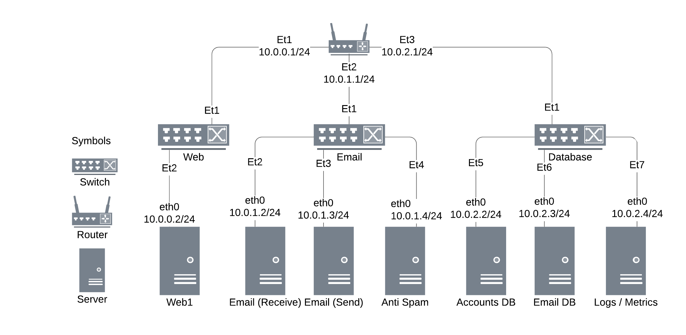

# Gravity Networking 101

## Requirements
- Gravity 101
- A 3 node gravity cluster

## Audience
This training is geared towards troubleshooting the network layer of gravity clusters, covering how the overlay network is configured within on-prem environments using the default flannel integrations. When using cloud integrations or encrypted networking using [wormhole](https://github.com/gravitational/wormhole) there are small differences which are not covered by this training. 

## Introduction
Networking within gravity and kubernetes can be overwhelming at first, with lots of moving parts. As software moved to the cloud, a movement was created to break software down into smaller applications that provide a service, allowing for independent development and patching, and getting past problems with tight integration, as well as including third party software. 

Within kubernetes, the design choice made is to allocate every unit of compute (each pod) an IP address. This means that from a networking perspective, each pod is it’s own addressable node on the network. 

Within this training topic, we’ll cover some introductory networking, how gravity uses flannel to build an overlay network for kubernetes pods, how network services within ingress are created, and troubleshoot a network problem.


## Networking Introduction

Before we start looking at overlay networking, let’s first take a look at some of the basic components to building networks. Knowing these components will greatly help us understand how the kubernetes network works later.

### Repeater

A repeater operates on a physical medium, such as a copper wire, and regenerates a signal on the wire, effectively making the wire longer. These days these are often referred to as an ethernet extender, but are not all that common these days.

### Hub

A hub is essentially a repeater which supports more than 2 ports. Instead it cross connects all ports within the device, and any signal received on one port, is repeated on all other ports within the hub. This allows multiple devices, like multiple computers to all be “wired” onto the same cable, and regenerate a signal from any computer.

This becomes the basis for building a multi-computer network, with a few limitations. Because all computers are “sharing” a cable, only one computer can transmit at a time, and all devices connected to the hub receive any transmission and need to filter out unneeded frames. Multiple devices transmitting at the same time creates collisions, or two frames transmitted ontop of each other which corrupt each other. 

### Bridge

A bridge is a more intelligent repeater, which adds some active intelligence in buffering frames for retransmission, and can learn about the topology of which devices are connected to which port of the bridge.

Buffering means that a bridge can wait before retransmitting a frame if another device is transmitting, so collisions don’t occur across the bridge. 

Topology awareness means that the bridge knows which devices are on which port of the bridge. So if a bridge receives a frame addressed for a particular computer, but that computer is on the source side of the bridge, the bridge doesn’t need to retransmit the frame to the other side of the bridge where that computer isn’t connected. 

Bridges don’t create separate networks, everything connected to the bridge still forms a single network, and single broadcast domain. A message to every computer on the network, a broadcast, will be forwarded by the bridge. But what a bridge does is create a separate collision domain, devices on either side of the bridge can transmit without causing collisions.

### Switch

These days a switch isn’t really a separate concept from a bridge. Switches are generally multiport devices that are intelligent, learn the topology of the network, and create separate collision domains on every port. If every device is directly connected directly to a switch, collisions no longer become a possibility.

Additionally, many active switches also have intelligence for preventing issues like network loops, where if there are multiple cables between two switches (a loop in the topology), the switch can identify the loop and block extra ports. Without this protection, broadcasts can be transmitted in a loop indefinitely.

Because broadcasts are still flooded on all ports, all the devices connected via switches still remain as part of the broadcast domain, they’re all part of the same network.

Realistically a switch and bridge are commonly considered interchangeable terms.


### Routers

A router is a device for connecting more than one network together. A router operates by “routing” packets between the networks the router is a member of. So a router is plugged into more than one network, and can be configured to relay the packets between the connected networks. 

Multiple routers can exist within a single network, allowing the routers to communicate over the shared network. This allows a packet to hop between various networks to reach the packets destination.

Example: To route a packet from my home laptop to google, I send a packet to my home router from my ISP, which forwards the packet across my DSL line to my routers ISP, which forwards the packet onwards to another router, until reaching the google server.

Note: There is a lot more to this, but this is a good starting conceptual model.


### Firewall

A firewall is a device for monitoring or controlling network traffic that crosses the firewall based on some configuration. At the simplest, configuration in the firewall will block or allow traffic based on simple rules, such as matching a port. However, many firewalls now have lots of features that allow for lots of flexibility in how the firewall acts.

Many OSes also include an endpoint firewall, so a system such as linux can have firewall policy for all packets processes by the OS.


### Network Address Translation (NAT) / Port Address Translation (PAT)

NAT and PAT are the ability to substitute addresses or port numbers as a packet is processed by a device. The number of IPv4 addresses are limited, so many networks use privately routable IP addresses. Private IP addresses only exist within a corporation, or set of networks, so to reach the internet, a device can translate IP addresses between private IP addresses and a shared public IP address.

Example: Most routers provided by an ISP, at least in North America, will give all computers on the home network an IP address like 192.168.1.5. The ISP will then issues a public IP address, such as 8.8.2.3. All computers on the home network can communicate with the internet, but the ISP router will NAT the packets to 8.8.2.3 when communicating on the internet.

Note: Commonly NAT and PAT together is just referred to as NAT.


### Multilayer switch / Bridging router (brouter)

Most “managed” network equipment combine features, allowing a single piece of hardware to provide functionality for switching, routing, firewall, and NAT on the same device.

This can be a huge and expensive multilayer switch from Cisco, or the home router provided by your ISP, or configured entirely within linux as virtual hardware.

Example: You may have a home router from your ISP, and on the back will be 4 wired ethernet ports, and an external port taking a coax (cable) line or rj11 (phone) line to connect to the ISP, and wifi capabilities as well, allowing for the following capabilities:
- Devices over wifi or wired can communicate with each other (switching)
- Devices can talk to the internet (routing / nat / firewall)
- A guest wifi network can be created with only internet access (firewall)
etc

## Example Network

Now that we’ve covered the basic building blocks, let’s use some of these components to build a simplified version of gmail. 

For this example, we’ll include several services:
- A web server, for showing emails to users
- An authentication database, that contains all of our user accounts
- An email database, where we store emails
- An email server, that receives incoming email
- An anti spam system, to block those saudi prince emails
- An outgoing email server, that sends emails to other servers
- A server for logs, metrics, and monitoring our services

We’ll also want to separate this into several networks:
- A network for the web servers
- A network for the incoming / outgoing email servers and spam
- A network for the database / storage / monitoring service


Let’s start by simply creating our 3 networks, assigning servers, and showing how these would be wired together:


Here we’ve introduced 3 network switches, one for each network, with one or more servers connected to the switch. This example only includes an example of each server, but in a more realistic scenario we would likely have multiple instances of each server for redundancy and capacity.


To allow the hosts within a network to communicate with each other, let’s add some IP addresses:


Each server within a network now belongs to the same network, with an assigned IP range. The switch will physically relay frames between the various switch ports to reach other servers within the same network. For example, the Accounts DB (10.0.2.2) can send it’s log to our log server (10.0.2.4/24) via the database switch. 

Now, let’s setup a router, so that we’re able to route packets between our various networks:



Even though our router is connected to each network, we still need to configure the servers to use the router to reach the other network. 

We have a few options for the configuration:
- Each route can be individual configured on each server
- A single larger route can be used, for all the possible subnets
- A default gateway can be configured, as a router that knows how to reach any destination the server doesn’t know how to reach.

Example routing tables for each option:

Individual routes (Web1):
```
root@web1:~/6.2.2# ip route
10.0.1.0/24 via 10.0.0.1 dev eth0 onlink
10.0.2.0/24 via 10.0.0.1 dev eth0 onlink
10.0.0.1 dev ens4  scope link
```
Using a single route (Web1):

```
root@web1:~/6.2.2# ip route
10.0.0.0/8 via 10.0.0.1 dev eth0 onlink
10.0.0.1 dev ens4  scope link
```

Using a default route (Web1):

```
root@web1:~/6.2.2# ip route
default via 10.0.0.1 dev ens4
10.0.1.0/24 via 10.0.0.1 dev eth0 onlink
```

A default route or default gateway, is simply a router (gateway) that we send all traffic to that a node doesn’t know a better location to send the traffic towards.

Each of the above examples is from the perspective of the web1 server, and the gateway is the router interface that is on the same network as the web1 server (10.0.0.1). 


Finally, we can add some infrastructure for connectivity to the internet:


## Introduction to Overlay Networking

With kubernetes and containerized applications, the idea is to disconnect the direct relationship between a running application and which physical servers are running the application. Our individual unit of software is no longer a machine running a particular application (or a set of applications), but instead is a pod that can be scheduled and started on any machine within a cluster that meets a pods requirements.

Networks running kubernetes clusters are configured in a wide variety of ways, and have very different capabilities. As a result, kubernetes itself doesn’t actually include networking, instead kubernetes provides a plugin system that allows for many different network ways to integrate networks. Instead kubernetes defines a set of requirements that the network must provide.

These requirements are:
Each Pod is assigned its own unique IP addresses
Each Pod must be able to reach all other Pods without NAT
Agents or software on a node must be able to communicate with all pods on the node without NAT

When we think about a pod conceptually, we can treat each pod like a virtual machine or host within our network. Each pod is assigned a name and IP address, so issues such as coordinating ports within a host are eliminated. If kubernetes assigns two pods with web servers listening on port 80, there isn’t a conflict.

Gravity is designed to run within what we refer to as hostile networks, which are simply customer networks that we don’t control, and as such are unlikely to provide us with an IP address for each pod. This is where overlay networks come in, gravity uses flannel to build a virtual network on top of the existing host network. 

When building an overlay network, the network will look very similar to the conceptual model we built above, but will instead be built out of virtual components within the linux kernel. Traffic is then encapsulated as it passes over the customers network, only requiring host to host communications.

As such, the requirements gravity has for the physical network, is that all gravity hosts are able to communicate with each other over a set of defined ports: https://gravitational.com/gravity/docs/requirements/#network

As a starting point, let’s take 3 blank hosts (or virtual machine) that are on the same network, and start building a diagram:


With this diagram, we can see that each server has an eth0 interface, and an address within the 192.168.33.0/24 network. In most cases, this network will be provided by the customer, and we don’t know how the network is made up. But for our case, we’ll just abstract away the customers network, as long as the hosts can communicate on the required ports, the customer network doesn’t matter to us.

When building an overlay network, we need a network range for the overlay network. In this example we will use 10.90.0.0/16 for the overlay network. The overlay network used by gravity can be changed at install time using the --pod-network-cidr install flag.

Within the 10.90.0.0/16 network, we will then allocate a smaller /24 network to each host:
Node 1 - 10.90.1.0/24
Node 2 - 10.90.2.0/24
Node 3 - 10.90.3.0/24

Any pod scheduled to a particular node, will get assigned an IP address belonging to the node. 

### Virtual Bridge

In order to build the overlay network, the first thing we’ll look at is a virtual bridge (a network switch) within the linux kernel. This will act as a network switch between any of the pods running on the host (that are running in their own namespaces).


In this example, we bridge is called cni0, which will match how gravity sets up the network. 

Using a running gravity cluster, let’s inspect the cni0 bridge.

```
root@kevin-test1:~# ip link show cni0
31: cni0: <BROADCAST,MULTICAST,UP,LOWER_UP> mtu 1410 qdisc noqueue state UP mode DEFAULT group default qlen 1000
    link/ether 8a:8c:ee:c4:6e:1a brd ff:ff:ff:ff:ff:ff

root@kevin-test1:~# ip addr show cni0
31: cni0: <BROADCAST,MULTICAST,UP,LOWER_UP> mtu 1410 qdisc noqueue state UP group default qlen 1000
    link/ether 8a:8c:ee:c4:6e:1a brd ff:ff:ff:ff:ff:ff
    inet 10.244.73.1/24 scope global cni0
       valid_lft forever preferred_lft forever
    inet6 fe80::888c:eeff:fec4:6e1a/64 scope link
       valid_lft forever preferred_lft forever

root@kevin-test1:~# ip neighbor show dev cni0
10.244.73.4 lladdr 52:db:bd:14:1b:b1 STALE
10.244.73.21 lladdr 76:9d:cd:ab:1a:ee REACHABLE
10.244.73.11 lladdr b6:a3:d3:a6:3c:28 STALE
10.244.73.24 lladdr 32:bf:66:4a:5b:6e REACHABLE
10.244.73.14 lladdr ba:89:c8:70:3a:9b DELAY
10.244.73.2 lladdr 62:a9:03:39:22:19 STALE
10.244.73.19 lladdr 2a:fe:a9:9b:26:78 REACHABLE
10.244.73.9 lladdr 66:54:c0:80:30:88 DELAY
10.244.73.22 lladdr 3a:cf:ce:97:f4:6a REACHABLE
10.244.73.12 lladdr 46:c2:3b:3f:0e:d7 STALE
10.244.73.17 lladdr a2:b1:2a:15:57:82 REACHABLE
10.244.73.7 lladdr fa:c7:10:6d:c0:c6 STALE
10.244.73.20 lladdr 62:be:2a:e7:f1:2f REACHABLE
10.244.73.10 lladdr a6:1e:eb:9d:70:d8 STALE
10.244.73.18 lladdr 32:40:04:7b:a9:33 STALE
10.244.73.8 lladdr c6:47:d7:36:58:4c REACHABLE
10.244.73.25 lladdr 5e:f6:13:92:9d:50 STALE
10.244.73.15 lladdr 52:74:30:27:1e:ed REACHABLE
10.244.73.3 lladdr 7e:c2:98:18:3d:c4 REACHABLE
10.244.73.16 lladdr 32:4c:4a:d1:a5:e0 REACHABLE
10.244.73.23 lladdr 42:ee:eb:94:61:c3 REACHABLE
10.244.73.13 lladdr 42:c6:ae:09:a1:42 REACHABLE

root@kevin-test1:~# sudo gravity exec -i brctl showmacs cni0
port no	mac addr		is local?	ageing timer
  5	12:4d:a8:4b:d0:be	yes		   0.00
  5	12:4d:a8:4b:d0:be	yes		   0.00
 16	1e:88:4c:e1:c6:52	yes		   0.00
 16	1e:88:4c:e1:c6:52	yes		   0.00
  1	22:6d:ce:9c:10:2e	yes		   0.00
  1	22:6d:ce:9c:10:2e	yes		   0.00
 13	2a:fe:a9:9b:26:78	no		   0.36
 11	32:4c:4a:d1:a5:e0	no		   7.64
 17	32:bf:66:4a:5b:6e	no		   0.36
  3	36:92:ab:47:3c:20	yes		   0.00
  3	36:92:ab:47:3c:20	yes		   0.00
 10	36:cf:a7:2a:2e:ea	yes		   0.00
 10	36:cf:a7:2a:2e:ea	yes		   0.00
 15	3a:cf:ce:97:f4:6a	no		   0.18
  8	42:c6:ae:09:a1:42	no		   0.47
 16	42:ee:eb:94:61:c3	no		   0.80
 14	4a:3b:bd:7b:75:67	yes		   0.00
 14	4a:3b:bd:7b:75:67	yes		   0.00
 10	52:74:30:27:1e:ed	no		   0.18
  9	5a:84:54:38:aa:de	yes		   0.00
  9	5a:84:54:38:aa:de	yes		   0.00
  4	62:be:2a:e7:f1:2f	no		   1.46
  5	66:54:c0:80:30:88	no		   0.18
 11	66:87:f1:f5:9d:0b	yes		   0.00
 11	66:87:f1:f5:9d:0b	yes		   0.00
 14	76:9d:cd:ab:1a:ee	no		   0.18
  4	76:df:7f:5b:82:98	yes		   0.00
  4	76:df:7f:5b:82:98	yes		   0.00
  2	7e:c2:98:18:3d:c4	no		   0.18
 17	8e:c8:fc:95:c9:3d	yes		   0.00
 17	8e:c8:fc:95:c9:3d	yes		   0.00
 13	92:58:18:16:d5:1b	yes		   0.00
 13	92:58:18:16:d5:1b	yes		   0.00
 12	a2:b1:2a:15:57:82	no		   5.04
  6	a6:1e:eb:9d:70:d8	no		   0.18
  8	ae:b9:fc:56:83:2c	yes		   0.00
  8	ae:b9:fc:56:83:2c	yes		   0.00
 12	b2:45:36:73:df:0b	yes		   0.00
 12	b2:45:36:73:df:0b	yes		   0.00
  7	b6:a3:d3:a6:3c:28	no		   5.08
  9	ba:89:c8:70:3a:9b	no		   4.56
  2	c2:58:cd:37:d2:38	yes		   0.00
  2	c2:58:cd:37:d2:38	yes		   0.00
  3	c6:47:d7:36:58:4c	no		   0.91
  7	d2:90:1a:0c:30:f7	yes		   0.00
  7	d2:90:1a:0c:30:f7	yes		   0.00
  6	fa:0d:80:34:4b:8a	yes		   0.00
  6	fa:0d:80:34:4b:8a	yes		   0.00
 15	fe:aa:3e:cc:ca:0c	yes		   0.00
 15	fe:aa:3e:cc:ca:0c	yes		   0.00
```


Notes:
- `ip link` shows the state of all network interfaces. 
    - MTU - Maximum Transmission Unit, what is the maximum packet size (without fragmentation) supported by this device.
    - UP/LOWER_UP - What is the physical state of this interface, is it UP (turned on), Down, No carrier, etc.
    - Ethernet address, this is the physical hardware address of this device. Because it’s a virtual device, the mac address will be dynamically generated, and won’t be an address programmed into the physical networking hardware.
- `ip addr` (or ip address) shows information about the IP addresses assigned to the device
    - In this case we have an IPv4 (inet) and IPv6 (inet6) address assigned within the kernel.
    - Scope refers to the routing scope, the ipv6 address is a scope “link” address, meaning it’s only relevant on that particular network. The ipv4 address is scope global, so it is a routable address. This can get confusing though, because our address is in the 10.0.0.0/8 reserved range, it is not globally routable, but is still considered a routable address range by the kernel.
- `ip neighbor show` shows us the learning state of arp (address resolution protocol), which is a mapping of IP addresses to hardware addresses. 
    - When transmitting a packet to a host on the same network, the link layer address needs to be that of the destination host, so that the network switches can send the packet out the correct link. These switches don’t send packets by IP, they send by MAC. So when the system needs to send a packet to 1.1.1.1, it needs to use the mapping of IP to MAC to address the correct link layer address on the network.
- `brctl showmacs cni0`
    - Brctl isn’t commonly installed on most linux distributions, but we ship a version in the gravity planet container, so it can be exec via planet by running sudo gravity exec -i
    - This shows is basically the equivalent of if we had a physical switch, which ports has the switch learned each mac address is on (note that this isn’t IP aware). 

### VXLAN

The next component we need to add to our overlay network, is some sort of tunneling technology, that will allow packets within our overlay network, to cross the physical network to reach other hosts as part of the overlay network. We’ll use vxlan as our technology of choice when on-premises, to encapsulate our virtual network within UDP packets on the host network.
https://en.wikipedia.org/wiki/Virtual_Extensible_LAN
https://tools.ietf.org/html/rfc7348

Vxlan creates a packet structure that looks something like the following:

```
0                   1                   2                   3
    0 1 2 3 4 5 6 7 8 9 0 1 2 3 4 5 6 7 8 9 0 1 2 3 4 5 6 7 8 9 0 1

   Outer Ethernet Header:
   +-+-+-+-+-+-+-+-+-+-+-+-+-+-+-+-+-+-+-+-+-+-+-+-+-+-+-+-+-+-+-+-+
   |             Outer Destination MAC Address                     |
   +-+-+-+-+-+-+-+-+-+-+-+-+-+-+-+-+-+-+-+-+-+-+-+-+-+-+-+-+-+-+-+-+
   | Outer Destination MAC Address | Outer Source MAC Address      |
   +-+-+-+-+-+-+-+-+-+-+-+-+-+-+-+-+-+-+-+-+-+-+-+-+-+-+-+-+-+-+-+-+
   |                Outer Source MAC Address                       |
   +-+-+-+-+-+-+-+-+-+-+-+-+-+-+-+-+-+-+-+-+-+-+-+-+-+-+-+-+-+-+-+-+
   |OptnlEthtype = C-Tag 802.1Q    | Outer.VLAN Tag Information    |
   +-+-+-+-+-+-+-+-+-+-+-+-+-+-+-+-+-+-+-+-+-+-+-+-+-+-+-+-+-+-+-+-+
   | Ethertype = 0x0800            |
   +-+-+-+-+-+-+-+-+-+-+-+-+-+-+-+-+

Outer IPv4 Header:
   +-+-+-+-+-+-+-+-+-+-+-+-+-+-+-+-+-+-+-+-+-+-+-+-+-+-+-+-+-+-+-+-+
   |Version|  IHL  |Type of Service|          Total Length         |
   +-+-+-+-+-+-+-+-+-+-+-+-+-+-+-+-+-+-+-+-+-+-+-+-+-+-+-+-+-+-+-+-+
   |         Identification        |Flags|      Fragment Offset    |
   +-+-+-+-+-+-+-+-+-+-+-+-+-+-+-+-+-+-+-+-+-+-+-+-+-+-+-+-+-+-+-+-+
   |  Time to Live |Protocl=17(UDP)|   Header Checksum             |
   +-+-+-+-+-+-+-+-+-+-+-+-+-+-+-+-+-+-+-+-+-+-+-+-+-+-+-+-+-+-+-+-+
   |                       Outer Source IPv4 Address               |
   +-+-+-+-+-+-+-+-+-+-+-+-+-+-+-+-+-+-+-+-+-+-+-+-+-+-+-+-+-+-+-+-+
   |                   Outer Destination IPv4 Address              |
   +-+-+-+-+-+-+-+-+-+-+-+-+-+-+-+-+-+-+-+-+-+-+-+-+-+-+-+-+-+-+-+-+

   Outer UDP Header:
   +-+-+-+-+-+-+-+-+-+-+-+-+-+-+-+-+-+-+-+-+-+-+-+-+-+-+-+-+-+-+-+-+
   |           Source Port         |       Dest Port = VXLAN Port  |
   +-+-+-+-+-+-+-+-+-+-+-+-+-+-+-+-+-+-+-+-+-+-+-+-+-+-+-+-+-+-+-+-+
   |           UDP Length          |        UDP Checksum           |
   +-+-+-+-+-+-+-+-+-+-+-+-+-+-+-+-+-+-+-+-+-+-+-+-+-+-+-+-+-+-+-+-+

   VXLAN Header:
   +-+-+-+-+-+-+-+-+-+-+-+-+-+-+-+-+-+-+-+-+-+-+-+-+-+-+-+-+-+-+-+-+
   |R|R|R|R|I|R|R|R|            Reserved                           |
   +-+-+-+-+-+-+-+-+-+-+-+-+-+-+-+-+-+-+-+-+-+-+-+-+-+-+-+-+-+-+-+-+
   |                VXLAN Network Identifier (VNI) |   Reserved    |
   +-+-+-+-+-+-+-+-+-+-+-+-+-+-+-+-+-+-+-+-+-+-+-+-+-+-+-+-+-+-+-+-+

   Inner Ethernet Header:
   +-+-+-+-+-+-+-+-+-+-+-+-+-+-+-+-+-+-+-+-+-+-+-+-+-+-+-+-+-+-+-+-+
   |             Inner Destination MAC Address                     |
   +-+-+-+-+-+-+-+-+-+-+-+-+-+-+-+-+-+-+-+-+-+-+-+-+-+-+-+-+-+-+-+-+
   | Inner Destination MAC Address | Inner Source MAC Address      |
   +-+-+-+-+-+-+-+-+-+-+-+-+-+-+-+-+-+-+-+-+-+-+-+-+-+-+-+-+-+-+-+-+
   |                Inner Source MAC Address                       |
   +-+-+-+-+-+-+-+-+-+-+-+-+-+-+-+-+-+-+-+-+-+-+-+-+-+-+-+-+-+-+-+-+
   |OptnlEthtype = C-Tag 802.1Q    | Inner.VLAN Tag Information    |
   +-+-+-+-+-+-+-+-+-+-+-+-+-+-+-+-+-+-+-+-+-+-+-+-+-+-+-+-+-+-+-+-+

   Payload:
   +-+-+-+-+-+-+-+-+-+-+-+-+-+-+-+-+-+-+-+-+-+-+-+-+-+-+-+-+-+-+-+-+
   | Ethertype of Original Payload |                               |
   +-+-+-+-+-+-+-+-+-+-+-+-+-+-+-+-+                               |
   |                                  Original Ethernet Payload    |
   |                                                               |
   |(Note that the original Ethernet Frame's FCS is not included)  |
   +-+-+-+-+-+-+-+-+-+-+-+-+-+-+-+-+-+-+-+-+-+-+-+-+-+-+-+-+-+-+-+-+

Frame Check Sequence:
   +-+-+-+-+-+-+-+-+-+-+-+-+-+-+-+-+-+-+-+-+-+-+-+-+-+-+-+-+-+-+-+-+
   |   New FCS (Frame Check Sequence) for Outer Ethernet Frame     |
   +-+-+-+-+-+-+-+-+-+-+-+-+-+-+-+-+-+-+-+-+-+-+-+-+-+-+-+-+-+-+-+-+
```

This packet structure is what allows us to “tunnel” the overlay network traffic onto our host network.


The flannel interface is a virtual interface created within the linux kernel. When traffic is “routed” to the flannel interface, the linux kernel will instead encapsulate the traffic within vxlan headers, and send the packet across the host network to the correct machine.

Let’s inspect the flannel.1 interface.

```
root@kevin-test1:~# ip link show flannel.1
28: flannel.1: <BROADCAST,MULTICAST,UP,LOWER_UP> mtu 1410 qdisc noqueue state UNKNOWN mode DEFAULT group default
    link/ether 3e:35:13:4b:5d:4d brd ff:ff:ff:ff:ff:ff

root@kevin-test1:~# ip -d addr show flannel.1
28: flannel.1: <BROADCAST,MULTICAST,UP,LOWER_UP> mtu 1410 qdisc noqueue state UNKNOWN group default
    link/ether 3e:35:13:4b:5d:4d brd ff:ff:ff:ff:ff:ff promiscuity 0
    vxlan id 1 local 10.162.0.7 dev ens4 srcport 0 0 dstport 8472 nolearning ageing 300 udpcsum
    inet 10.244.73.0/32 scope global flannel.1
       valid_lft forever preferred_lft forever
    inet6 fe80::3c35:13ff:fe4b:5d4d/64 scope link
       valid_lft forever preferred_lft forever

root@kevin-test1:~# bridge fdb show | grep flannel.1
da:77:5d:47:e8:42 dev flannel.1 dst 10.162.0.6 self permanent
1a:5c:0b:92:f9:fb dev flannel.1 dst 10.162.0.5 self permanent


root@kevin-test1:~# ip route | grep flannel.1
10.244.24.0/24 via 10.244.24.0 dev flannel.1 onlink
10.244.71.0/24 via 10.244.71.0 dev flannel.1 onlink

root@kevin-test1:~# ip neigh show | grep flannel.1
10.244.24.0 dev flannel.1 lladdr da:77:5d:47:e8:42 PERMANENT
10.244.71.0 dev flannel.1 lladdr 1a:5c:0b:92:f9:fb PERMANENT
```

Notes:
- `ip link show` shows us largely the same link layer information we’ve already seen
    - Note the state is unknown, the vxlan interface acts as a sort of virtual interface tied to multiple underlying hardware, so it doesn’t indicate operation state.
    - The mac is dynamically generated for this particular interface.
- `ip address show` also shows largely the same information, except in this case we have additional vxlan configuration
    - Note, the -d flag is needed to show the vxlan configuration
    - Flannel uses a sort of interesting IP assignment, where it assigns the .0/32 interface address to the interface. This IP address is largely irrelevant, so it should be noted that this IP address can not be reliably pinged
    - Inside the vxlan configuration, we see vlan id 1, the local IP and parent device running vxlan (in this example ens4). We also see other options such as dstport and nolearning.
    - Dstport is the udp port externally that vxlan is running on. All hosts within the cluster use the same port as per the linux kernel configuration.
    - Flannel sets the vxlan to nolearning, as flannel will take care of communicating the learning state itself and statically configure each host.
- `bridge fdb shows` us the kernels interface forwarding database, on which interfaces a particular mac exists, and in this vxlan case, what destination IP on the host network to send packets towards matching the particular mac.
    - You will note that these are permanent records, they have been statically configured by flannel and are not dynamically discovered.
    - Ip route shows us the IP routing table, where we indicate to get to a specific /24 network, to route via a particular router (the .0 of the network), and to use the flannel.1 (our vxlan) interface.
- `ip neighbor` shows us the arp entries created using the flannel.1 vxlan interface
    - Again these are permanent entries configured by flannel, to allow IP address to physical mappings.

Using this example, if we want to send a packet towards 10.244.24.1:
1. Lookup the routing table, that says 10.244.24.1 should be routed using gateway 10.244.24.0 and interface flannel.1
2. Map 10.244.24.0 (the gateway) to a physical address on the overlay network (da:77:5d:47:e8:42)
3. The special vxlan interface, then encapsulates the packet, and identifies that host network IP to send the packet to (da:77:5d:47:e8:42 dst 10.162.0.6). 
4. The encapsulated packet is then transmitted to host 10.162.0.6

### Routing

The next component to consider is routing of packets. The linux kernel can act as a router when configured to do so, and route packets between the overlay network and virtual bridge that have been created on the host. 


Notes:
- The default route still goes towards the host network, we only want the overlay network to use the overlay network interfaces.
- Because we’ve created more specific routes for our virtual network, if those IP addresses also exist on our customers network, the packets will no longer be routed to the customers network.

Let’s inspect the routing configuration:

```
root@kevin-test1:~# ip route
default via 10.162.0.1 dev ens4
10.100.0.0/16 dev flannel.null  scope link
10.162.0.1 dev ens4  scope link
10.244.24.0/24 via 10.244.24.0 dev flannel.1 onlink
10.244.71.0/24 via 10.244.71.0 dev flannel.1 onlink
10.244.73.0/24 dev cni0  proto kernel  scope link  src 10.244.73.1
172.17.0.0/16 dev docker0  proto kernel  scope link  src 172.17.0.1 linkdown

root@kevin-test1:~# ip netconf
ipv4 dev lo forwarding on rp_filter off mc_forwarding 0 proxy_neigh off
ipv4 dev ens4 forwarding on rp_filter strict mc_forwarding 0 proxy_neigh off
ipv4 dev docker0 forwarding on rp_filter strict mc_forwarding 0 proxy_neigh off
ipv4 dev flannel.1 forwarding on rp_filter strict mc_forwarding 0 proxy_neigh off
ipv4 dev dummy0 forwarding on rp_filter strict mc_forwarding 0 proxy_neigh off
ipv4 dev flannel.null forwarding on rp_filter strict mc_forwarding 0 proxy_neigh off
ipv4 dev cni0 forwarding on rp_filter strict mc_forwarding 0 proxy_neigh off
ipv4 dev veth4722669f forwarding on rp_filter strict mc_forwarding 0 proxy_neigh off
ipv4 dev veth99e981de forwarding on rp_filter strict mc_forwarding 0 proxy_neigh off
ipv4 dev veth5b740e98 forwarding on rp_filter strict mc_forwarding 0 proxy_neigh off
ipv4 dev veth131bfd8c forwarding on rp_filter strict mc_forwarding 0 proxy_neigh off
ipv4 dev veth23c1d17e forwarding on rp_filter strict mc_forwarding 0 proxy_neigh off
ipv4 dev veth2735c78d forwarding on rp_filter strict mc_forwarding 0 proxy_neigh off
ipv4 dev vethd9250664 forwarding on rp_filter strict mc_forwarding 0 proxy_neigh off
ipv4 dev veth78417f1e forwarding on rp_filter strict mc_forwarding 0 proxy_neigh off
ipv4 dev veth9054a7f3 forwarding on rp_filter strict mc_forwarding 0 proxy_neigh off
ipv4 dev veth909bc67c forwarding on rp_filter strict mc_forwarding 0 proxy_neigh off
ipv4 dev vethb2e8bae9 forwarding on rp_filter strict mc_forwarding 0 proxy_neigh off
ipv4 dev veth229867f3 forwarding on rp_filter strict mc_forwarding 0 proxy_neigh off
ipv4 dev vetha04a5cb8 forwarding on rp_filter strict mc_forwarding 0 proxy_neigh off
ipv4 dev vethd036dc6d forwarding on rp_filter strict mc_forwarding 0 proxy_neigh off
ipv4 dev veth762b5142 forwarding on rp_filter strict mc_forwarding 0 proxy_neigh off
ipv4 dev veth6a430e7e forwarding on rp_filter strict mc_forwarding 0 proxy_neigh off
ipv4 dev veth5915990d forwarding on rp_filter strict mc_forwarding 0 proxy_neigh off
ipv4 all forwarding on rp_filter strict mc_forwarding 0 proxy_neigh off
ipv4 default forwarding on rp_filter strict mc_forwarding 0 proxy_neigh off
ipv6 dev lo forwarding off mc_forwarding 0 proxy_neigh off
ipv6 dev ens4 forwarding off mc_forwarding 0 proxy_neigh off
ipv6 dev docker0 forwarding off mc_forwarding 0 proxy_neigh off
ipv6 dev flannel.1 forwarding off mc_forwarding 0 proxy_neigh off
ipv6 dev dummy0 forwarding off mc_forwarding 0 proxy_neigh off
ipv6 dev flannel.null forwarding off mc_forwarding 0 proxy_neigh off
ipv6 dev cni0 forwarding off mc_forwarding 0 proxy_neigh off
ipv6 dev veth4722669f forwarding off mc_forwarding 0 proxy_neigh off
ipv6 dev veth99e981de forwarding off mc_forwarding 0 proxy_neigh off
ipv6 dev veth5b740e98 forwarding off mc_forwarding 0 proxy_neigh off
ipv6 dev veth131bfd8c forwarding off mc_forwarding 0 proxy_neigh off
ipv6 dev veth23c1d17e forwarding off mc_forwarding 0 proxy_neigh off
ipv6 dev veth2735c78d forwarding off mc_forwarding 0 proxy_neigh off
ipv6 dev vethd9250664 forwarding off mc_forwarding 0 proxy_neigh off
ipv6 dev veth78417f1e forwarding off mc_forwarding 0 proxy_neigh off
ipv6 dev veth9054a7f3 forwarding off mc_forwarding 0 proxy_neigh off
ipv6 dev veth909bc67c forwarding off mc_forwarding 0 proxy_neigh off
ipv6 dev vethb2e8bae9 forwarding off mc_forwarding 0 proxy_neigh off
ipv6 dev veth229867f3 forwarding off mc_forwarding 0 proxy_neigh off
ipv6 dev vetha04a5cb8 forwarding off mc_forwarding 0 proxy_neigh off
ipv6 dev vethd036dc6d forwarding off mc_forwarding 0 proxy_neigh off
ipv6 dev veth762b5142 forwarding off mc_forwarding 0 proxy_neigh off
ipv6 dev veth6a430e7e forwarding off mc_forwarding 0 proxy_neigh off
ipv6 dev veth5915990d forwarding off mc_forwarding 0 proxy_neigh off
ipv6 all forwarding off mc_forwarding 0 proxy_neigh off
ipv6 default forwarding off mc_forwarding 0 proxy_neigh off
```

Notes:
- `ip route` to inspect the routing table
    - We can see the default route towards the host network
    - We also get the link local route for the host network
    - We get routes for each flannel subnet on other hosts
    - We have a link local route for a bridge, which is this particular hosts flannel subnet
    - We get a null route for the service network, this allows the service network to function on hosts that don’t contain a default route.
- `ip netconf` shows us the kernel configuration for each particular interface
    - Ignore the veth devices for now
    - We can see ipv4 forwarding is turned on
    - Rp_filter / mc_forwarding / proxy_neigh aren’t within the scope of this training

### Network Namespaces

The last component we need to take a look at, is the pod network itself, which will use network namespaces to virtualize the kernel network stack. 

This network stack virtualization creates a bit of a wiggle however, if the pod runs in it’s own virtual network stack, it’s not part of any of the hosts networking. The linux kernel has a special virtual interface we can use to connect the namespaces, called a veth pair (a virtual ethernet pair). A veth pair acts like two network interfaces that are connected by a cable. This allows us to place one end of the cable within the pods virtual network stack, and the other end within the host network stack.

Lets include some pods in our conceptual diagram:


Let’s take a look at what this looks like on our gravity cluster:

```
root@kevin-test1:~# sudo gravity exec brctl show
bridge name	bridge id		STP enabled	interfaces
cni0		8000.8a8ceec46e1a	no		veth131bfd8c
							veth229867f3
							veth23c1d17e
							veth2735c78d
							veth4722669f
							veth5915990d
							veth5b740e98
							veth6a430e7e
							veth762b5142
							veth78417f1e
							veth9054a7f3
							veth909bc67c
							veth99e981de
							vetha04a5cb8
							vethb2e8bae9
							vethd036dc6d
							vethd9250664
docker0		8000.024247d8d221	no

root@kevin-test1:~# ip link
1: lo: <LOOPBACK,UP,LOWER_UP> mtu 65536 qdisc noqueue state UNKNOWN mode DEFAULT group default qlen 1000
    link/loopback 00:00:00:00:00:00 brd 00:00:00:00:00:00
2: ens4: <BROADCAST,MULTICAST,UP,LOWER_UP> mtu 1460 qdisc mq state UP mode DEFAULT group default qlen 1000
    link/ether 42:01:0a:a2:00:07 brd ff:ff:ff:ff:ff:ff
27: docker0: <NO-CARRIER,BROADCAST,MULTICAST,PROMISC,UP> mtu 1500 qdisc noqueue state DOWN mode DEFAULT group default
    link/ether 02:42:47:d8:d2:21 brd ff:ff:ff:ff:ff:ff
28: flannel.1: <BROADCAST,MULTICAST,UP,LOWER_UP> mtu 1410 qdisc noqueue state UNKNOWN mode DEFAULT group default
    link/ether 3e:35:13:4b:5d:4d brd ff:ff:ff:ff:ff:ff
29: dummy0: <BROADCAST,NOARP> mtu 1500 qdisc noop state DOWN mode DEFAULT group default qlen 1000
    link/ether 7e:c3:58:20:6b:a3 brd ff:ff:ff:ff:ff:ff
30: flannel.null: <BROADCAST,NOARP,UP,LOWER_UP> mtu 1500 qdisc noqueue state UNKNOWN mode DEFAULT group default qlen 1000
    link/ether 82:5e:4d:08:f6:c8 brd ff:ff:ff:ff:ff:ff
31: cni0: <BROADCAST,MULTICAST,UP,LOWER_UP> mtu 1410 qdisc noqueue state UP mode DEFAULT group default qlen 1000
    link/ether 8a:8c:ee:c4:6e:1a brd ff:ff:ff:ff:ff:ff
33: veth4722669f@if3: <BROADCAST,MULTICAST,UP,LOWER_UP> mtu 1410 qdisc noqueue master cni0 state UP mode DEFAULT group default
    link/ether c2:58:cd:37:d2:38 brd ff:ff:ff:ff:ff:ff link-netnsid 1
35: veth99e981de@if3: <BROADCAST,MULTICAST,UP,LOWER_UP> mtu 1410 qdisc noqueue master cni0 state UP mode DEFAULT group default
    link/ether 22:6d:ce:9c:10:2e brd ff:ff:ff:ff:ff:ff link-netnsid 0
38: veth5b740e98@if3: <BROADCAST,MULTICAST,UP,LOWER_UP> mtu 1410 qdisc noqueue master cni0 state UP mode DEFAULT group default
    link/ether 36:92:ab:47:3c:20 brd ff:ff:ff:ff:ff:ff link-netnsid 2
39: veth131bfd8c@if3: <BROADCAST,MULTICAST,UP,LOWER_UP> mtu 1410 qdisc noqueue master cni0 state UP mode DEFAULT group default
    link/ether 12:4d:a8:4b:d0:be brd ff:ff:ff:ff:ff:ff link-netnsid 4
40: veth23c1d17e@if3: <BROADCAST,MULTICAST,UP,LOWER_UP> mtu 1410 qdisc noqueue master cni0 state UP mode DEFAULT group default
    link/ether fa:0d:80:34:4b:8a brd ff:ff:ff:ff:ff:ff link-netnsid 5
41: veth2735c78d@if3: <BROADCAST,MULTICAST,UP,LOWER_UP> mtu 1410 qdisc noqueue master cni0 state UP mode DEFAULT group default
    link/ether d2:90:1a:0c:30:f7 brd ff:ff:ff:ff:ff:ff link-netnsid 6
43: vethd9250664@if3: <BROADCAST,MULTICAST,UP,LOWER_UP> mtu 1410 qdisc noqueue master cni0 state UP mode DEFAULT group default
    link/ether ae:b9:fc:56:83:2c brd ff:ff:ff:ff:ff:ff link-netnsid 7
44: veth78417f1e@if3: <BROADCAST,MULTICAST,UP,LOWER_UP> mtu 1410 qdisc noqueue master cni0 state UP mode DEFAULT group default
    link/ether 5a:84:54:38:aa:de brd ff:ff:ff:ff:ff:ff link-netnsid 8
45: veth9054a7f3@if3: <BROADCAST,MULTICAST,UP,LOWER_UP> mtu 1410 qdisc noqueue master cni0 state UP mode DEFAULT group default
    link/ether 36:cf:a7:2a:2e:ea brd ff:ff:ff:ff:ff:ff link-netnsid 9
46: veth909bc67c@if3: <BROADCAST,MULTICAST,UP,LOWER_UP> mtu 1410 qdisc noqueue master cni0 state UP mode DEFAULT group default
    link/ether 66:87:f1:f5:9d:0b brd ff:ff:ff:ff:ff:ff link-netnsid 10
47: vethb2e8bae9@if3: <BROADCAST,MULTICAST,UP,LOWER_UP> mtu 1410 qdisc noqueue master cni0 state UP mode DEFAULT group default
    link/ether b2:45:36:73:df:0b brd ff:ff:ff:ff:ff:ff link-netnsid 11
49: veth229867f3@if3: <BROADCAST,MULTICAST,UP,LOWER_UP> mtu 1410 qdisc noqueue master cni0 state UP mode DEFAULT group default
    link/ether 92:58:18:16:d5:1b brd ff:ff:ff:ff:ff:ff link-netnsid 12
50: vetha04a5cb8@if3: <BROADCAST,MULTICAST,UP,LOWER_UP> mtu 1410 qdisc noqueue master cni0 state UP mode DEFAULT group default
    link/ether 76:df:7f:5b:82:98 brd ff:ff:ff:ff:ff:ff link-netnsid 13
51: vethd036dc6d@if3: <BROADCAST,MULTICAST,UP,LOWER_UP> mtu 1410 qdisc noqueue master cni0 state UP mode DEFAULT group default
    link/ether 4a:3b:bd:7b:75:67 brd ff:ff:ff:ff:ff:ff link-netnsid 3
52: veth762b5142@if3: <BROADCAST,MULTICAST,UP,LOWER_UP> mtu 1410 qdisc noqueue master cni0 state UP mode DEFAULT group default
    link/ether fe:aa:3e:cc:ca:0c brd ff:ff:ff:ff:ff:ff link-netnsid 14
53: veth6a430e7e@if3: <BROADCAST,MULTICAST,UP,LOWER_UP> mtu 1410 qdisc noqueue master cni0 state UP mode DEFAULT group default
    link/ether 1e:88:4c:e1:c6:52 brd ff:ff:ff:ff:ff:ff link-netnsid 15
54: veth5915990d@if3: <BROADCAST,MULTICAST,UP,LOWER_UP> mtu 1410 qdisc noqueue master cni0 state UP mode DEFAULT group default
    link/ether 8e:c8:fc:95:c9:3d brd ff:ff:ff:ff:ff:ff link-netnsid 16

root@kevin-test1:~# nsenter -t `ps -ef | grep " /coredns" | grep -v grep | awk '{print $2}'` -n ip a
1: lo: <LOOPBACK,UP,LOWER_UP> mtu 65536 qdisc noqueue state UNKNOWN group default qlen 1000
    link/loopback 00:00:00:00:00:00 brd 00:00:00:00:00:00
    inet 127.0.0.1/8 scope host lo
       valid_lft forever preferred_lft forever
3: eth0@if33: <BROADCAST,MULTICAST,UP,LOWER_UP> mtu 1410 qdisc noqueue state UP group default
    link/ether 7e:c2:98:18:3d:c4 brd ff:ff:ff:ff:ff:ff link-netnsid 0
    inet 10.244.73.3/24 scope global eth0
       valid_lft forever preferred_lft forever
```

Notes:
- `brctl show` shows us each bridge, and all the devices (in our case veth devices) that have been connected to the particular bridge. 
    - On gravity systems we also see a docker bridge get created by docker. In later versions of gravity this has been removed as this bridge isn’t used.
- `ip link` shows us lots of ip links, because we have to create one for each kubernetes pod with the other end in it’s own namespace. Matching the particular pair can be done but isn’t easy, so it’s out of scope of this training.
- `nsenter` can be used to enter another namespace, in this case the coredns pod that we run on each host.
    - We can see the pods view of the network only shows a loopback, and the pods end of the veth pair which is located within the namespace.

We’ve now inspected all the infrastructure that allows traffic to flow from pod to pod.

## Flannel

Flannel has been mentioned a few times so far, which is a daemon and cni plugin written by coreos for setting up and configuring an overlay network. Flannel takes care of all the network setup for the overlay network and pods automatically, and coordinates the IP subnet assignments using etcd.

Let’s take a look at what flannels internal configuration:

```
knisbet@kevin-test1:~$ sudo gravity exec etcdctl get /coreos.com/network/config | jq '.'
{
  "Network": "10.244.0.0/16",
  "Backend": {
    "Type": "vxlan",
    "RouteTableFilter": [
      "tag:KubernetesCluster=niftypoitras6944"
    ],
    "Port": 8472
  }
}
```

Here we can see the Network range assigned to flannel for building the overlay network, which defaults to 10.244.0.0/16 prior to gravity 7, and 100.96.0.0/16 from gravity 7 and later. This range can also be changed at installation time by passing the `--pod-network-cidr` flag to the installation process.

We can also see which port flannel is running on (--vxlan-port option on install) and that we’re currently using vxlan integrations. The RouteTableFilter is only relevant for cloud integrations, and is out of scope of this training.

We can also get a listing of the individual subnets created by flannel, which are each a key value pair in etcd.

```
knisbet@kevin-test1:~$ sudo gravity exec etcdctl ls /coreos.com/network/subnets
/coreos.com/network/subnets/10.244.24.0-24
/coreos.com/network/subnets/10.244.71.0-24
/coreos.com/network/subnets/10.244.73.0-24

knisbet@kevin-test1:~$ sudo gravity exec etcdctl get /coreos.com/network/subnets/10.244.24.0-24 | jq '.'
{
  "PublicIP": "10.162.0.6",
  "BackendType": "vxlan",
  "BackendData": {
    "VtepMAC": "96:55:5d:21:ec:47"
  }
}
```

Each flannel node will try and publish a /24 network within the pod network range, and if it succeeds the node is now considered to have a subnet lease, where it owns that subnet for a timeout. When flannel configures a vxlan device, it will then update the lease with the particular mac address generated for that interface.

Each flannel instance within the cluster will monitor etcd for any new, changed, or deleted leases, and update the linux kernel configuration to match. This is where all the static configuration we looked at above comes from.

We can also inspect the flannel logs for problems:

```
root@kevin-test1:~/6.2.2# sudo gravity exec journalctl -u flanneld
-- Logs begin at Thu 2020-01-23 16:55:06 UTC, end at Thu 2020-01-23 17:26:05 UTC. --
Jan 23 16:55:06 kevin-test1 systemd[1]: Starting Flannel...
Jan 23 16:55:06 kevin-test1 wait-for-etcd.sh[178]: /usr/bin/etcdctl: line 10: /usr/bin/etcdctl-cmd: No such file or directory
Jan 23 16:55:09 kevin-test1 wait-for-etcd.sh[178]: cluster is healthy
Jan 23 16:55:10 kevin-test1 etcdctl[627]: {"Network":"10.244.0.0/16", "Backend": {"Type": "vxlan", "RouteTableFilter": ["tag:KubernetesCluster=flamboyantwescoff8628"], "Port": 8472}}
Jan 23 16:55:10 kevin-test1 systemctl[691]: active
Jan 23 16:55:10 kevin-test1 wait-for-flannel.sh[693]: "waiting for flannel to start."
Jan 23 16:55:10 kevin-test1 flanneld[692]: I0123 16:55:10.487907     692 main.go:439] Searching for interface using 10.162.0.7
Jan 23 16:55:10 kevin-test1 flanneld[692]: I0123 16:55:10.488237     692 main.go:516] Using interface with name ens4 and address 10.162.0.7
Jan 23 16:55:10 kevin-test1 flanneld[692]: I0123 16:55:10.488252     692 main.go:533] Defaulting external address to interface address (10.162.0.7)
Jan 23 16:55:10 kevin-test1 flanneld[692]: warning: ignoring ServerName for user-provided CA for backwards compatibility is deprecated
Jan 23 16:55:10 kevin-test1 flanneld[692]: I0123 16:55:10.488872     692 main.go:250] Created subnet manager: Etcd Local Manager with Previous Subnet: None
Jan 23 16:55:10 kevin-test1 flanneld[692]: I0123 16:55:10.488885     692 main.go:253] Installing signal handlers
Jan 23 16:55:10 kevin-test1 flanneld[692]: I0123 16:55:10.807707     692 main.go:375] Found network config - Backend type: vxlan
Jan 23 16:55:10 kevin-test1 flanneld[692]: I0123 16:55:10.807822     692 vxlan.go:120] VXLAN config: VNI=1 Port=8472 GBP=false DirectRouting=false
Jan 23 16:55:11 kevin-test1 flanneld[692]: I0123 16:55:11.907783     692 local_manager.go:234] Picking subnet in range 10.244.1.0 ... 10.244.255.0
Jan 23 16:55:12 kevin-test1 flanneld[692]: I0123 16:55:12.275977     692 local_manager.go:220] Allocated lease (10.244.19.0/24) to current node (10.162.0.7)
Jan 23 16:55:12 kevin-test1 flanneld[692]: I0123 16:55:12.276464     692 main.go:315] Wrote subnet file to /run/flannel/subnet.env
Jan 23 16:55:12 kevin-test1 flanneld[692]: I0123 16:55:12.276479     692 main.go:325] Finished starting backend.
Jan 23 16:55:12 kevin-test1 flanneld[692]: I0123 16:55:12.276489     692 main.go:326] Running backend.
Jan 23 16:55:12 kevin-test1 flanneld[692]: I0123 16:55:12.276626     692 vxlan_network.go:60] watching for new subnet leases
Jan 23 16:55:12 kevin-test1 flanneld[692]: I0123 16:55:12.286679     692 iptables.go:115] Some iptables rules are missing; deleting and recreating rules
Jan 23 16:55:12 kevin-test1 flanneld[692]: I0123 16:55:12.286706     692 iptables.go:137] Deleting iptables rule: -s 10.244.0.0/16 -d 10.244.0.0/16 -j RETURN
Jan 23 16:55:12 kevin-test1 flanneld[692]: I0123 16:55:12.288217     692 iptables.go:137] Deleting iptables rule: -s 10.244.0.0/16 ! -d 224.0.0.0/4 -j MASQUERADE
Jan 23 16:55:12 kevin-test1 flanneld[692]: I0123 16:55:12.289695     692 iptables.go:137] Deleting iptables rule: ! -s 10.244.0.0/16 -d 10.244.19.0/24 -j RETURN
Jan 23 16:55:12 kevin-test1 flanneld[692]: I0123 16:55:12.291072     692 iptables.go:137] Deleting iptables rule: ! -s 10.244.0.0/16 -d 10.244.0.0/16 -j MASQUERADE
Jan 23 16:55:12 kevin-test1 flanneld[692]: I0123 16:55:12.292544     692 iptables.go:125] Adding iptables rule: -s 10.244.0.0/16 -d 10.244.0.0/16 -j RETURN
Jan 23 16:55:12 kevin-test1 flanneld[692]: I0123 16:55:12.295367     692 iptables.go:125] Adding iptables rule: -s 10.244.0.0/16 ! -d 224.0.0.0/4 -j MASQUERADE
Jan 23 16:55:12 kevin-test1 flanneld[692]: I0123 16:55:12.298248     692 iptables.go:125] Adding iptables rule: ! -s 10.244.0.0/16 -d 10.244.19.0/24 -j RETURN
Jan 23 16:55:12 kevin-test1 flanneld[692]: I0123 16:55:12.301654     692 iptables.go:125] Adding iptables rule: ! -s 10.244.0.0/16 -d 10.244.0.0/16 -j MASQUERADE
Jan 23 16:55:12 kevin-test1 flanneld[692]: I0123 16:55:12.308067     692 main.go:418] Waiting for 22h59m59.600169973s to renew lease
Jan 23 16:55:13 kevin-test1 systemd[1]: Started Flannel.
Jan 23 17:08:19 kevin-test1 flanneld[692]: I0123 17:08:19.427401     692 vxlan_network.go:138] adding subnet: 10.244.6.0/24 PublicIP: 10.162.0.6 VtepMAC: 62:4f:73:05:24:e1
Jan 23 17:10:19 kevin-test1 flanneld[692]: I0123 17:10:19.659338     692 vxlan_network.go:138] adding subnet: 10.244.11.0/24 PublicIP: 10.162.0.5 VtepMAC: 12:42:55:2d:79:ab
```

## Load Balancing / Ingress / NAT / service discovery / etc
Now that we’ve seen how the overlay network fits together, let’s take a look at how a few of the upper layer kubernetes services are delivered within the cluster.

### Services / Endpoints
https://kubernetes.io/docs/concepts/services-networking/service/


Pods within kubernetes are our unit of compute, but they’re also considered ephemeral components, the pods come and go. For software to communicate with other software within our cluster, kubernetes introduces the concept of a service, a stable way to reach a set of software, regardless of the state of individual pods.

There are a number of different service types, allowing for external access or internal access to a service. Each service also comes with a cluster IP, a stable internal IP address assigned to the service. This is where load balancing and NAT come into play.

Each kubernetes service will create a simple load balancer, with each pod backing the service receiving an equal share of traffic. This is done using clever use of iptables rules. The cluster IP doesn’t actually exist on the network, instead iptables intercepts packets destined to the cluster IP, and applies NAT towards the pod serving the request.

Each service has a matching endpoint object, which indicates the current addresses that match a particular service.

Let’s inspect the kube-dns service to see what this configuration looks like:

```
root@kevin-test1:~# kubectl -n kube-system describe svc/kube-dns
Name:              kube-dns
Namespace:         kube-system
Labels:            k8s-app=kube-dns
                   kubernetes.io/cluster-service=true
                   kubernetes.io/name=CoreDNS
Annotations:       prometheus.io/port: 9153
                   prometheus.io/scrape: true
Selector:          k8s-app=kube-dns
Type:              ClusterIP
IP:                10.100.214.177
Port:              dns  53/UDP
TargetPort:        53/UDP
Endpoints:         10.244.26.3:53,10.244.60.2:53,10.244.74.2:53
Port:              dns-tcp  53/TCP
TargetPort:        53/TCP
Endpoints:         10.244.26.3:53,10.244.60.2:53,10.244.74.2:53
Session Affinity:  None
Events:            <none>

root@kevin-test1:~# kubectl -n kube-system describe endpoints/kube-dns
Name:         kube-dns
Namespace:    kube-system
Labels:       k8s-app=kube-dns
              kubernetes.io/cluster-service=true
              kubernetes.io/name=CoreDNS
Annotations:  endpoints.kubernetes.io/last-change-trigger-time: 2020-01-23T16:55:22Z
Subsets:
  Addresses:          10.244.26.3,10.244.60.2,10.244.74.2
  NotReadyAddresses:  <none>
  Ports:
    Name     Port  Protocol
    ----     ----  --------
    dns      53    UDP
    dns-tcp  53    TCP

Events:  <none>

root@kevin-test1:~# iptables-save | grep kube-dns:
-A KUBE-SERVICES ! -s 10.244.0.0/16 -d 10.100.214.177/32 -p udp -m comment --comment "kube-system/kube-dns:dns cluster IP" -m udp --dport 53 -j KUBE-MARK-MASQ
-A KUBE-SERVICES -d 10.100.214.177/32 -p udp -m comment --comment "kube-system/kube-dns:dns cluster IP" -m udp --dport 53 -j KUBE-SVC-TCOU7JCQXEZGVUNU
-A KUBE-SERVICES ! -s 10.244.0.0/16 -d 10.100.214.177/32 -p tcp -m comment --comment "kube-system/kube-dns:dns-tcp cluster IP" -m tcp --dport 53 -j KUBE-MARK-MASQ
-A KUBE-SERVICES -d 10.100.214.177/32 -p tcp -m comment --comment "kube-system/kube-dns:dns-tcp cluster IP" -m tcp --dport 53 -j KUBE-SVC-ERIFXISQEP7F7OF4

root@kevin-test1:~# iptables-save | grep KUBE-SVC-TCOU7JCQXEZGVUNU
:KUBE-SVC-TCOU7JCQXEZGVUNU - [0:0]
-A KUBE-SERVICES -d 10.100.214.177/32 -p udp -m comment --comment "kube-system/kube-dns:dns cluster IP" -m udp --dport 53 -j KUBE-SVC-TCOU7JCQXEZGVUNU
-A KUBE-SVC-TCOU7JCQXEZGVUNU -m statistic --mode random --probability 0.33332999982 -j KUBE-SEP-XHBRZSJMEH6MYGK7
-A KUBE-SVC-TCOU7JCQXEZGVUNU -m statistic --mode random --probability 0.50000000000 -j KUBE-SEP-HISYQ42PVY4ARKND
-A KUBE-SVC-TCOU7JCQXEZGVUNU -j KUBE-SEP-RFADV2KEC4EL5Y4F

root@kevin-test1:~# iptables-save | grep  KUBE-SEP-XHBRZSJMEH6MYGK7
:KUBE-SEP-XHBRZSJMEH6MYGK7 - [0:0]
-A KUBE-SEP-XHBRZSJMEH6MYGK7 -s 10.244.26.3/32 -j KUBE-MARK-MASQ
-A KUBE-SEP-XHBRZSJMEH6MYGK7 -p udp -m udp -j DNAT --to-destination 10.244.26.3:53
-A KUBE-SVC-TCOU7JCQXEZGVUNU -m statistic --mode random --probability 0.33332999982 -j KUBE-SEP-XHBRZSJMEH6MYGK7
```

###

Some kubernetes services also allow external access to services running within a cluster. These services act identically to the ClusterIP service above, but have a type of Node Port or Load Balancer, also allowing for external access via a port on any of the kubernetes clusters hosts.

A Load Balancer type works identically to a Node Port, except when run with integrations, the integrations will provision a load balancer, such as an AWS ELB.

The way a Node Port works, is by coordinating and assigning the same port on each node within the cluster. A host external to the cluster, can then connect to any node on the cluster, and be NATed and load balanced to the pods making up the service.

Let’s take a look at an example of this:

```
kevin-test1:/$ iptables-save | grep kube-system/gravity-site:we
-A KUBE-NODEPORTS -p tcp -m comment --comment "kube-system/gravity-site:web" -m tcp --dport 32009 -j KUBE-MARK-MASQ
-A KUBE-NODEPORTS -p tcp -m comment --comment "kube-system/gravity-site:web" -m tcp --dport 32009 -j KUBE-SVC-OFJYUSYH7DQHBRC2
-A KUBE-SERVICES ! -s 10.244.0.0/16 -d 10.100.169.61/32 -p tcp -m comment --comment "kube-system/gravity-site:web cluster IP" -m tcp --dport 3009 -j KUBE-MARK-MASQ
-A KUBE-SERVICES -d 10.100.169.61/32 -p tcp -m comment --comment "kube-system/gravity-site:web cluster IP" -m tcp --dport 3009 -j KUBE-SVC-OFJYUSYH7DQHBRC2

kevin-test1:/$ iptables-save | grep KUBE-SVC-OFJYUSYH7DQHBRC2
:KUBE-SVC-OFJYUSYH7DQHBRC2 - [0:0]
-A KUBE-NODEPORTS -p tcp -m comment --comment "kube-system/gravity-site:web" -m tcp --dport 32009 -j KUBE-SVC-OFJYUSYH7DQHBRC2
-A KUBE-SERVICES -d 10.100.169.61/32 -p tcp -m comment --comment "kube-system/gravity-site:web cluster IP" -m tcp --dport 3009 -j KUBE-SVC-OFJYUSYH7DQHBRC2
-A KUBE-SVC-OFJYUSYH7DQHBRC2 -j KUBE-SEP-INXK3UZ5UZJK7GSG

kevin-test1:/$ iptables-save | grep KUBE-SEP-INXK3UZ5UZJK7GSG
:KUBE-SEP-INXK3UZ5UZJK7GSG - [0:0]
-A KUBE-SEP-INXK3UZ5UZJK7GSG -s 10.162.0.6/32 -j KUBE-MARK-MASQ
-A KUBE-SEP-INXK3UZ5UZJK7GSG -p tcp -m tcp -j DNAT --to-destination 10.162.0.6:3009
-A KUBE-SVC-OFJYUSYH7DQHBRC2 -j KUBE-SEP-INXK3UZ5UZJK7GSG
```

### Service Discovery (DNS)

https://kubernetes.io/docs/concepts/services-networking/dns-pod-service/

Kubernetes clusters also present a DNS based mechanism to resolve names to the service IP addresses, allowing deployed software to reach a service by name. In gravity clusters from 5.2+ we use coredns for service discovery, which is a modern DNS server that tightly integrates with kubernetes.

Gravity also uses CoreDNS within the planet container, for locating the cluster leader. When doing queries within planet, it’s possible to get different responses than software running within the cluster that’s accessing the kubernetes DNS.

One of the unique features of gravity, is that we deploy two separate kube-dns services, one that is spread across master nodes, and another across workers. This allows the first request to go towards workers, and any retry to go to a master, guaranteeing a different node processes the retry. What we’ve found in our experience, is that if a particular node is experiencing issues, such as being overloaded, a certain portion of queries will fail, since there is a chance that the retry is sent to the same node as the first request.

```
kevin-test1:/$ dig kube-dns.kube-system.svc.cluster.local.

; <<>> DiG 9.10.3-P4-Debian <<>> kube-dns.kube-system.svc.cluster.local.
;; global options: +cmd
;; Got answer:
;; ->>HEADER<<- opcode: QUERY, status: NOERROR, id: 24491
;; flags: qr aa rd; QUERY: 1, ANSWER: 1, AUTHORITY: 0, ADDITIONAL: 1
;; WARNING: recursion requested but not available

;; OPT PSEUDOSECTION:
; EDNS: version: 0, flags:; udp: 4096
;; QUESTION SECTION:
;kube-dns.kube-system.svc.cluster.local.	IN A

;; ANSWER SECTION:
kube-dns.kube-system.svc.cluster.local.	5 IN A	10.100.214.177

;; Query time: 0 msec
;; SERVER: 127.0.0.2#53(127.0.0.2)
;; WHEN: Mon Jan 27 06:59:33 UTC 2020
;; MSG SIZE  rcvd: 121

kevin-test1:/$ dig @`kubectl -n kube-system get svc/kube-dns -o json | jq -r '.spec.clusterIP'` kube-dns.kube-system.cluster.local

; <<>> DiG 9.10.3-P4-Debian <<>> @10.100.214.177 kube-dns.kube-system.cluster.local
; (1 server found)
;; global options: +cmd
;; Got answer:
;; ->>HEADER<<- opcode: QUERY, status: NXDOMAIN, id: 29218
;; flags: qr aa rd ra; QUERY: 1, ANSWER: 0, AUTHORITY: 1, ADDITIONAL: 1

;; OPT PSEUDOSECTION:
; EDNS: version: 0, flags:; udp: 4096
;; QUESTION SECTION:
;kube-dns.kube-system.cluster.local. IN	A

;; AUTHORITY SECTION:
cluster.local.		30	IN	SOA	ns.dns.cluster.local. hostmaster.cluster.local. 1580106841 7200 1800 86400 30

;; Query time: 0 msec
;; SERVER: 10.100.214.177#53(10.100.214.177)
;; WHEN: Mon Jan 27 07:05:49 UTC 2020
;; MSG SIZE  rcvd: 156


kevin-test1:/$ dig any.kube-dns.kube-system.svc.cluster.local.

; <<>> DiG 9.10.3-P4-Debian <<>> any.kube-dns.kube-system.svc.cluster.local.
;; global options: +cmd
;; Got answer:
;; ->>HEADER<<- opcode: QUERY, status: NOERROR, id: 13203
;; flags: qr aa rd; QUERY: 1, ANSWER: 3, AUTHORITY: 0, ADDITIONAL: 1
;; WARNING: recursion requested but not available

;; OPT PSEUDOSECTION:
; EDNS: version: 0, flags:; udp: 4096
;; QUESTION SECTION:
;any.kube-dns.kube-system.svc.cluster.local. IN A

;; ANSWER SECTION:
any.kube-dns.kube-system.svc.cluster.local. 5 IN A 10.244.26.3
any.kube-dns.kube-system.svc.cluster.local. 5 IN A 10.244.60.2
any.kube-dns.kube-system.svc.cluster.local. 5 IN A 10.244.74.2

;; Query time: 0 msec
;; SERVER: 127.0.0.2#53(127.0.0.2)
;; WHEN: Mon Jan 27 07:00:35 UTC 2020
;; MSG SIZE  rcvd: 245

```


Notes:
- Each of these queries is run from within the planet container
- Planet is preconfigured to use CoreDNS internally
- Planet can also reach the kubernetes services, allowing queries towards the cluster DNS

One thing to keep in mind, is it’s common to spend a great deal of time troubleshooting DNS related issues, when the problem is within the overlay network. The reason is often the first symptoms of a problem are a DNS issue, but an issue with DNS can indicate a problem with DNS, or a problem with the overlay network itself.


## Troubleshooting and Breaking things

Now that we’ve hopefully seen how most of the networking pieces fit together, and how the overlay network has been put together, let’s look at how to test that the pieces are working.

### tcpdump

Tcpdump lets us inspect and filter traffic that’s passing on different interfaces within the linux kernel, including virtual interfaces. This allows us to inspect the packet structure, and track packets step by step as they cross the network. 

Here’s an example tcpdump command, let’s break down what it means.
tcpdump -vni cni0 port 53

-v - increase verbosity, can be increased multiple times -vv or -vvv
-n - don’t convert port numbers to names (personal preference)
-i cni0 - the interface to capture on
port 53 - This is the capture filter. There might be lots of traffic, too much traffic for tcpdump to capture without dropping packets, or too much for us to analyze. So we can create a filter that limits the amount of traffic that is captured.


Note: The `any` interface is a special pseudo interface that linux offers, that captures packets from all interfaces, but it’s taken at a different point in the processing chain, and as such does not contain physical layer addresses. This is fine depending on what you’re looking for, you may see the same packet within the capture multiple times, because it crosses multiple interfaces. Firewall rules may drop the packet before it’s captured.

Note: The way tcpdump links into the kernel, when capturing on a specific interface, will take place between the ethernet device, and the kernel network stack. For incoming packets, this allows visibility into all packets received by the kernel before filtering or manipulation, and for outgoing packets anything that should appear on the wire. The physical hardware can drop packets for various reasons, so there is no guarantee that a packet will be sent by the host, or received.

Let’s capture a couple DNS packets to see what they look like:

```
kevin-test1:/$ tcpdump -vni cni0 port 53
tcpdump: listening on cni0, link-type EN10MB (Ethernet), capture size 262144 bytes
17:46:28.343581 IP (tos 0x0, ttl 64, id 24849, offset 0, flags [DF], proto UDP (17), length 131)
    10.244.19.19.41293 > 10.244.11.3.53: 47194+ A? alertmanager-main-0.alertmanager-operated.monitoring.svc.monitoring.svc.cluster.local. (103)
17:46:28.343581 IP (tos 0x0, ttl 64, id 24850, offset 0, flags [DF], proto UDP (17), length 131)
    10.244.19.19.47032 > 10.244.11.3.53: 19925+ AAAA? alertmanager-main-0.alertmanager-operated.monitoring.svc.monitoring.svc.cluster.local. (103)
17:46:28.344257 IP (tos 0x0, ttl 62, id 19076, offset 0, flags [DF], proto UDP (17), length 224)
    10.100.214.177.53 > 10.244.19.19.47032: 19925 NXDomain* 0/1/0 (196)
17:46:28.344264 IP (tos 0x0, ttl 62, id 19075, offset 0, flags [DF], proto UDP (17), length 224)
    10.100.214.177.53 > 10.244.19.19.41293: 47194 NXDomain 0/1/0 (196)
...
^C
48 packets captured
48 packets received by filter
0 packets dropped by kernel
```

Let’s break down what we’re seeing:

`tcpdump: listening on cni0` 
- What we’re capturing.

`link-type EN10MB (Ethernet)` 
- What type of link we’re capturing. Even though this is a virtual bridge, it still shows as an ethernet device from tcpdump’s perspective.


`capture size 262144 bytes`
- How much kernel memory is being allocated for the capture. If this buffer overflows, packets will be dropped from the capture, and not be seen.


`17:46:28.343581`
- Timestamp the packet was received. This is actually a complicated item, but for most purposes it is simply the wall clock when the packet was received.

`IP (tos 0x0, ttl 64, id 24849, offset 0, flags [DF], proto UDP (17), length 131)`
- This is an Ipv4 packet, and a decode of important header fields: https://en.wikipedia.org/wiki/IPv4#Header

`10.244.19.19.41293 > 10.244.11.3.53`
- Source IP: 10.244.19.19
- Source Port: 41293
- Destination IP: 10.244.11.3
- Destination Port: 53


`A? alertmanager-main-0.alertmanager-operated.monitoring.svc.monitoring.svc.cluster.local. (103)`
- This is a partial decode of the upper layer protocol, in this case DNS. Tcpdump isn’t able to decode every protocol, but for some protocols it can help us.

`A?`
 - This is a question, for an A record

`Alertmanager-main-0.alertmanager-operated.monitoring.svc.monitoring.svc.cluster.local.`
 - The name we would like an A record for


And if we look at the answer to this packet

```7:46:28.344257 IP (tos 0x0, ttl 62, id 19076, offset 0, flags [DF], proto UDP (17), length 224)
    10.100.214.177.53 > 10.244.19.19.47032: 19925 NXDomain* 0/1/0 (196)
```

The most important part is: `NXDomain*`

This tells us the DNS server responded with a non-existant name, there are no records that match the DNS query.

An alternative answer we receive could look something like this:
```
17:46:28.353524 IP (tos 0x0, ttl 62, id 11695, offset 0, flags [DF], proto UDP (17), length 202)
    10.100.214.177.53 > 10.244.19.19.46676: 971 1/0/0 alertmanager-main-1.alertmanager-operated.monitoring.svc.cluster.local. A 10.244.19.23 (174)
```

`alertmanager-main-1.alertmanager-operated.monitoring.svc.cluster.local. A 10.244.19.23`
- This tells us we got an answer for a particular name, it’s an A record, and the IP address is 10.244.19.23.


Note: It’s very common to get NXDomain responses for names. Kubernetes service discovery includes several search domains, many questions towards the DNS server will combine search paths, and are expected to not resolve to a valid IP address.


### Introducing a configuration problem

To do some network troubleshooting, we’ll now intentionally break the network by disabling ip_forwarding (routing) on the cni0 bridge interface, and investigate how the cluster reacts to this problem.

Break the configuration on the first node within the cluster:
```
root@kevin-test1:~/6.2.2# sysctl -w net.ipv4.conf.cni0.forwarding=0
net.ipv4.conf.cni0.forwarding = 0

root@kevin-test1:~/6.2.2# ip netconf show dev cni0
ipv4 dev cni0 forwarding off rp_filter strict mc_forwarding 0 proxy_neigh off
```

Let's assume that a user has reported a software problem, which shows a problem with DNS resolution, and we need to troubleshoot. On the first node, let's check DNS resolution.

First, let's retrieve the service addresses for our DNS services:
```
kevin-test1:/$ kctl get svc -lkubernetes.io/name=CoreDNS
NAME              TYPE        CLUSTER-IP       EXTERNAL-IP   PORT(S)         AGE
kube-dns          ClusterIP   10.100.214.177   <none>        53/UDP,53/TCP   5d4h
kube-dns-worker   ClusterIP   10.100.222.204   <none>        53/UDP,53/TCP   5d4h
```

And then try to query the DNS service:
```
kevin-test1:/$ host kubernetes.default.svc.cluster.local 10.100.214.177
Using domain server:
Name: 10.100.214.177
Address: 10.100.214.177#53
Aliases:

kubernetes.default.svc.cluster.local has address 10.100.0.1
kevin-test1:/$ host kubernetes.default.svc.cluster.local 10.100.222.204
;; connection timed out; no servers could be reached
```

This is a normal result. As part of the gravity design, DNS services are split into two groups, a service split across master nodes, and a service across workers. Because our test cluster is only 3 nodes, we only have DNS pods running on our masters, and the worker service will be unused by the cluster. Only worker nodes will use worker DNS services.

So DNS resolution towards the service address is working from node 1.

The service IP is load balanced though, so we should also test each pod individually to make sure we're not just lucky in getting a working test.

```
kubectl -n kube-system get po -lk8s-app=kube-dns -o wide
NAME            READY   STATUS    RESTARTS   AGE   IP            NODE         NOMINATED NODE   READINESS GATES
coredns-jqg2x   1/1     Running   0          74m   10.244.6.2    node-3   <none>           <none>
coredns-kr5m4   1/1     Running   0          72m   10.244.11.3   node-2   <none>           <none>
coredns-xkgqk   1/1     Running   0          87m   10.244.19.3   node-1   <none>           <none>
```
```
root@kevin-test1:~/6.2.2# host kubernetes.default.svc.cluster.local 10.244.6.2
Using domain server:
Name: 10.244.6.2
Address: 10.244.6.2#53
Aliases:

kubernetes.default.svc.cluster.local has address 10.100.0.1
```
```
root@kevin-test1:~/6.2.2# host kubernetes.default.svc.cluster.local 10.244.11.3
Using domain server:
Name: 10.244.11.3
Address: 10.244.11.3#53
Aliases:

kubernetes.default.svc.cluster.local has address 10.100.0.1
```
```
root@kevin-test1:~/6.2.2# host kubernetes.default.svc.cluster.local 10.244.19.3
Using domain server:
Name: 10.244.19.3
Address: 10.244.19.3#53
Aliases:

kubernetes.default.svc.cluster.local has address 10.100.0.1
```

Let's investigate node 2, and see if node 2 provides similar results:

```
root@kevin-test2:~/6.2.2# host kubernetes.default.svc.cluster.local 10.244.6.2
Using domain server:
Name: 10.244.6.2
Address: 10.244.6.2#53
Aliases:

kubernetes.default.svc.cluster.local has address 10.100.0.1
```
```
root@kevin-test2:~/6.2.2# host kubernetes.default.svc.cluster.local 10.244.11.3
Using domain server:
Name: 10.244.11.3
Address: 10.244.11.3#53
Aliases:

kubernetes.default.svc.cluster.local has address 10.100.0.1
```
```
root@kevin-test2:~/6.2.2# host kubernetes.default.svc.cluster.local 10.244.19.3
;; connection timed out; no servers could be reached
```

While node 1 doesn't show any symptoms, node 2 is consistently unable to connect to pod 10.244.19.3 which is assigned to node 1.

Let's continue to investigate on node 2, by trying to isolate where the network interruption occurs. We can try and ping some of the interfaces running on node 1. The pod IP is 10.244.19.3, which means the flannel.1 interface will be 10.244.19.0/32 and the bridge interface will be 10.244.19.1/24.

```
root@kevin-test2:~/6.2.2# ping -c1 10.244.19.0
PING 10.244.19.0 (10.244.19.0) 56(84) bytes of data.
64 bytes from 10.244.19.0: icmp_seq=1 ttl=64 time=0.322 ms

--- 10.244.19.0 ping statistics ---
1 packets transmitted, 1 received, 0% packet loss, time 0ms
rtt min/avg/max/mdev = 0.322/0.322/0.322/0.000 ms
```

Because we're able to ping the flannel.1 interface from another node, this strongly suggests that the overlay network is functioning in this case. We're able to reach the first interface within node 1, let's continue by testing the bridge.

```
root@kevin-test2:~/6.2.2# ping -c1 10.244.19.1
PING 10.244.19.1 (10.244.19.1) 56(84) bytes of data.
64 bytes from 10.244.19.1: icmp_seq=1 ttl=64 time=0.297 ms

--- 10.244.19.1 ping statistics ---
1 packets transmitted, 1 received, 0% packet loss, time 0ms
rtt min/avg/max/mdev = 0.297/0.297/0.297/0.000 ms
```

When pinging the cni0 interfae on host 1, we also get a response. So we're able to route packets within node 1 between the flannel.1 interface and the cni0 bridge from a remote node.

Next, let's try an icmp ping towards the pod, instead of a DNS query.

```
root@kevin-test2:~/6.2.2# ping -c1 10.244.19.3
PING 10.244.19.3 (10.244.19.3) 56(84) bytes of data.

--- 10.244.19.3 ping statistics ---
1 packets transmitted, 0 received, 100% packet loss, time 0ms
```

Pinging the pod fails, so at this point we've isolated the issue to be somewhere internal to host 1. The request, or the response, appears to be failing somewhere internal to host 1. Let's try and visualize what we've isolated so far.

#### From node 1:


##### From node 2:


Next, let's use tcpdump to get a packet capture of the packets. We'll filter to just icmp traffic, that we're testing with ping packets.

```
root@kevin-test1:~# tcpdump -vni cni0 icmp
```

And on the second node, re-run the ping towards the pod, to trigger packets within our tcpdump.
```
root@kevin-test2:~# ping -c1 10.244.19.28
root@kevin-test2:~# ping -c1 10.244.19.28
PING 10.244.19.28 (10.244.19.28) 56(84) bytes of data.

--- 10.244.19.28 ping statistics ---
1 packets transmitted, 0 received, 100% packet loss, time 0ms
```

Example tcpdump results:
```
root@kevin-test1:~# tcpdump -vni cni0 icmp
tcpdump: listening on cni0, link-type EN10MB (Ethernet), capture size 262144 bytes
02:20:55.105370 IP (tos 0x0, ttl 63, id 39191, offset 0, flags [DF], proto ICMP (1), length 84)
    10.244.6.0 > 10.244.19.28: ICMP echo request, id 11493, seq 1, length 64
02:20:55.105407 IP (tos 0x0, ttl 64, id 9224, offset 0, flags [none], proto ICMP (1), length 84)
    10.244.19.28 > 10.244.6.0: ICMP echo reply, id 11493, seq 1, length 64
^C
2 packets captured
2 packets received by filter
0 packets dropped by kernel
```

What's interesting about this result, is we see the `ICMP echo request` towards the pod, but also an "ICMP echo reply" back towards the source of the ping. The pod is actually responding, and it's the responses that are being lost.

Let's double check that the response packet isn't seen on the flannel.1 interface and making it to the overlay network.

```
root@kevin-test1:~# tcpdump -vni flannel.1 icmp
tcpdump: listening on flannel.1, link-type EN10MB (Ethernet), capture size 262144 bytes
02:27:44.234324 IP (tos 0x0, ttl 64, id 14486, offset 0, flags [DF], proto ICMP (1), length 84)
    10.244.6.0 > 10.244.19.28: ICMP echo request, id 14713, seq 1, length 64
^C
1 packet captured
1 packet received by filter
0 packets dropped by kernel
```

On this interface, we don't see the reply. Now that we've isolated where specifically the packet is being lost, we can focus our attention on the kernel configuration that can impact the traffic flow. 

Our tests have validated:


In this case we can then investigate the configuration of our bridge interface, routing table, etc to look for problems that may only affect this particular traffic flow.

```
root@kevin-test1:~# ip netconf show dev cni0
ipv4 dev cni0 forwarding off rp_filter strict mc_forwarding 0 proxy_neigh off
```

And here we can see that the sysctl setting we changed earlier, is showing us that IPv4 forwarding on the cni0 interface has been disabled. 

To re-enable ip forwarding:

```
sysctl -w net.ipv4.conf.cni0.forwarding=1
```

This completes the gravity network training.