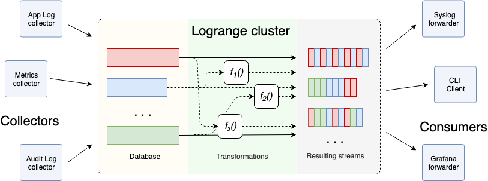

# Gravity Logging (for Gravity 6.0 and later)

## Prerequisites

Docker 101, Kubernetes 101, Gravity 101.

## Introduction

Gravity clusters come preconfigured with the logging infrastructure that collects the logs from all running containers, forwards them to a single destination and makes them available for viewing and querying via an API.

In Gravity 6.0 and later the logging stack is based on [Logrange](https://www.logrange.io/) - an open-source streaming database for aggregating application logs and other machine-generated data from multiple sources.

## Pods / Containers Logs Locations

Before diving into Gravity’s logging infrastructure, let’s explore how it is set up in Kubernetes in general.

Kubernetes sets up symlinks in well-known locations for logs of all containers running in the cluster and groups them up in two directories on each node, by pod and by container. The directories where these logs go are `/var/log/pods` and `/var/log/containers` respectively.

Note that these directories reside inside the planet container, not on the host.

On each node, the logs of all containers running in the same pod will be grouped in that pod directory under `/var/log/pods`:

```bash
planet$ ls -l /var/log/pods/<pod-id>/
```

If we look at the logs of a particular container, we’ll see that these are in fact symlinks to the actual log files Docker keeps inside its data directory:

```bash
planet$ ls -l /var/log/pods/01146b3e-3709-11ea-b8d5-080027f6e425/init/
total 4
lrwxrwxrwx 1 root root 161 Jan 14 20:04 0.log -> /ext/docker/containers/236f...-json.log
```

In addition to `/var/log/pods`, Kubernetes also sets up a `/var/log/containers` directory which has a flat structure and the logs of all containers running on the node. The log files are also symlinks that point to the respective files in `/var/log/pods`:

```bash
planet$ ls -l /var/log/containers/
total 180
lrwxrwxrwx 1 root root 66 Jan 15 00:24 bandwagon-6c4b...-lqbll_kube-system_bandwagon-2641....log -> /var/log/pods/0b8e.../bandwagon/1.log
```

## Logrange Components

Logrange consists of the following main components: collector, aggregator and forwarder. These components can be seen in the following diagram.



### Collector

Collector collects the logs from cluster nodes and sends them to the aggregator. It runs on each cluster node as a DaemonSet:

```bash
$ kubectl -nkube-system get ds,po -lapp=lr-collector
```

If we take a peek into its configuration, we’ll see the paths it monitors for the logs:

```bash
$ kubectl -nkube-system get cm/lr-collector -oyaml
        ...
        "IncludePaths": [
          "/var/log/containers/*.log",
          "/var/log/containers/*/*.log",
          "/var/lib/gravity/site/*/*.log"
        ],
```

Like explained above, the first 2 directories contain the logs for all containers running on the node. The 3rd directory contains Gravity-specific operation logs.

From the same configuration we can also see that container logs are marked with specific tags which are then used for searching:

```
            "Meta": {
              "Tags": {
                "pod": "{pod}",
                "ns": "{ns}",
                "cname": "{cname}",
                "cid": "{cid}"
              }
            }
```

### Aggregator

Aggregator is a data storage plane that receives and aggregates log data coming from the collectors. It runs as a Deployment:

```bash
$ kubectl -nkube-system get deploy,po -lapp=lr-aggregator
```

Its configuration is also stored in a ConfigMap:

```bash
$ kubectl -nkube-system get configmaps/lr-aggregator -oyaml
```

From the configuration we can see that Logrange keeps its data under Gravity state directory, in `/var/lib/gravity/logrange/data/`.

### Forwarder

Forwarder extracts logs from the aggregator based on some criteria and sends them to a 3-rd party system. It also runs as a Deployment:

```bash
$ kubectl -nkube-system get deploy,po -lapp=lr-forwarder
```

Forwarder is used for forwarding logs to other destinations when the user configured custom log forwarders which we’ll take a look at below.

### Adapter

Adapter is not a part of a standard Logrange deployment but rather a Gravity-specific component that provides some additional functionality. It runs as a Deployment:

```bash
$ kubectl -nkube-system get deploy,pods -lapp=log-collector
```

The adapter adds the following functionality:

* Serves an HTTP API that allows to query all collected logs. The API is exposed via a Kubernetes service and is used by Gravity Control Panel to provide search functionality. Internally, adapter uses Logrange’s [LQL](https://www.logrange.io/docs/lql.html) to query the data.
* It is also responsible for updating log forwarder configurations when they are created or modified by users.

## Custom Log Forwarders

Logrange forwarder can be configured to ship logs to a remote destination for aggregation, for example to an external rsyslog server, Splunk, etc.

To support this scenario, Gravity exposes a resource called LogForwarder. Let’s create a log forwarder that will be forwarding the logs to some server running on our node:

```bash
$ cat <<EOF > logforwarder.yaml
kind: logforwarder
version: v2
metadata:
   name: forwarder1
spec:
   address: 192.168.99.102:514
   protocol: udp
EOF
$ gravity resource create logforwarder.yaml
```

To see all currently configured log forwarders we can use the resource get command:

```bash
$ gravity resource get logforwarders
Name           Address                Protocol
----           -------                --------
forwarder1     192.168.99.102:514     udp
```

When the resource is created, Gravity does the following to set up the forwarding.

The `kube-system/log-forwarders` ConfigMap is updated by Gravity with information about the newly created or updated forwarder:

```bash
$ kubectl -nkube-system get configmaps/log-forwarders -oyaml
```

Then, Logrange adapter picks up the change and updates the forwarder configuration:

```bash
$ kubectl -nkube-system get configmaps/lr-forwarder -oyaml
```

After that, the forwarder starts sending the logs to the configured destination using the syslog protocol.

We can test this by capturing all traffic on this port using netcat:

```bash
$ sudo nc -4ulk 514
```

To deconfigure a log forwarder, we can just delete its Gravity resource and it will take care of removing its configuration:

```bash
$ gravity resource rm logforwarders forwarder1
```
